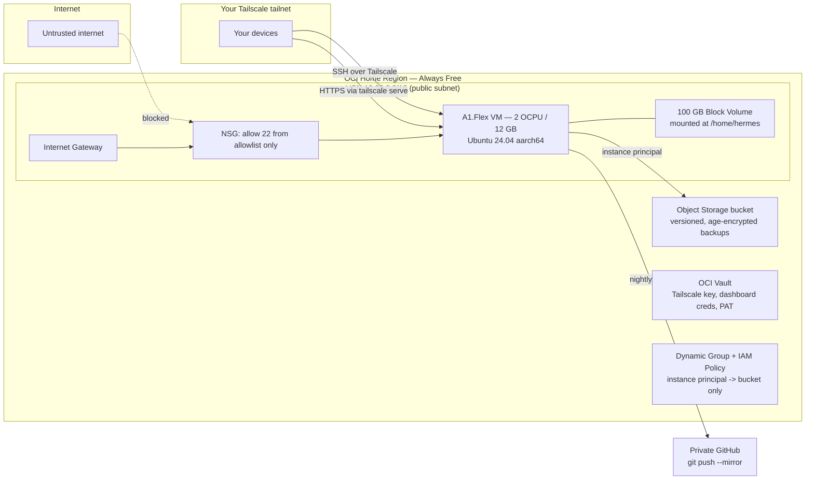

# Plan: Hermes Agent on Oracle Cloud Always Free (Terraform)

## 1. Goals & confirmed decisions

- Run [Hermes Agent](https://hermes-agent.nousresearch.com/docs/) on Oracle Cloud Infrastructure (OCI), staying inside the **Always Free** tier forever.
- Dashboard reachable only from allowlisted access — chosen design: **Tailscale-only** (no public HTTP/HTTPS ingress at all).
- Ability to SSH into the box to change LLM provider/model at any time.
- Full agent tooling: built-in browser toolset, Playwright MCP, GitHub MCP, and room to add more MCPs later.
- Everything reproducible/redeployable via Terraform.
- Backups: the Hermes home directory (memory, tasks/kanban, sessions, skills, cron, MCP tokens) and workspace artifacts must survive instance loss, plus an off-cloud copy.
- Development done in phases, each on its own branch, driven by rotating personas, with small commits and a review pass per phase.
- **Work-in-progress limit of 1**: only one task may be "in progress" at any moment — both in how *we* execute this plan (one phase/todo in flight at a time) and at runtime on the agent's own Kanban task board.
- **Provider rotation**: the active LLM provider must rotate automatically every 4 hours across the configured pool (OpenRouter → NVIDIA NIM → Mistral → …), via a system crontab entry on the VM.

### Decisions locked in
| Decision | Choice | Why |
|---|---|---|
| Dashboard exposure | Bind `127.0.0.1:9119`, front with `tailscale serve --https=443` | Hermes docs bless this exact shape; zero public attack surface |
| Dashboard auth provider | Username/password (`basic` provider, scrypt hash) | Docs say `basic` is fine on a VPN-only/trusted-network dashboard; OAuth would need a public redirect we don't want |
| LLM providers | OpenRouter, NVIDIA NIM, Mistral — all as custom OpenAI-compatible endpoints, empty key slots, changeable over SSH via `hermes model` | Requested: open selection, no hard pin |
| Tenancy mode | Strictly Always Free (no Pay-As-You-Go upgrade) | Requested; accept OCI's idle-reclamation risk, mitigate with real workload + fast redeploy |
| Backup storage | **OCI Object Storage** (private bucket, Standard tier, versioned, instance-principal auth, client-side `age` encryption) | 20 GB / 50k requests free, per-object granularity + versioning; volume backups are all-or-nothing and capped at 5 free — used only as a secondary full-VM DR tier |
| Off-cloud copy | `git push --mirror` of workspace repos to a private GitHub | Requested; survives total tenancy loss |
| Browser engine | Lightpanda (Hermes-spawned, ~16x lower RAM than Chrome) as default, packaged Chromium as automatic fallback for screenshots/vision | Free-tier RAM is scarce (12 GB total, shared with everything else) |
| Playwright MCP | Enabled with `lazy: true` + idle/lifetime recycling | Docs explicitly warn Playwright MCP keeps a full Chromium resident forever without this |
| GitHub integration | `gh` CLI + bundled GitHub skills (primary) + stdio GitHub MCP with a scoped PAT (secondary) | Docs: GitHub is deliberately excluded from the hosted MCP catalog; skills path is "more capable" |
| Task WIP limit | Enforce exactly one "in progress" task at a time, both in our dev process and on the agent's Kanban board | Requested; keeps focus, avoids partially-finished parallel work and split context |
| Provider rotation | System crontab entry rotates the active provider every 4 hours across the configured pool | Requested; spreads usage/rate-limits across providers automatically |

---

## 2. Research findings (source of truth for implementation)

### 2.1 Hermes Agent
- Install: `curl -fsSL https://hermes-agent.nousresearch.com/install.sh | bash`. Linux **aarch64 is Tier 1** supported.
- Layout: repo at `~/.hermes/hermes-agent/`, all runtime state under `~/.hermes/` (or `$HERMES_HOME`).
- Installer provisions `uv`, Python 3.11, Node 26, ripgrep, ffmpeg automatically. Manual prerequisites: `git`, `curl`, `xz-utils`.
- Playwright's `--with-deps` step needs root (`sudo npx playwright install-deps chromium`); `--skip-browser` / `--skip-computer-use` exist to opt out.
- Non-sudo/service-user installs are supported; user-level systemd units need `sudo loginctl enable-linger <user>` to survive logout/reboot.
- Symlinked `HERMES_HOME` and subdirectories are supported, but Hermes refuses to auto-create a missing link target (fails as a storage error) — the mount must exist before first run.

**Dashboard**
- `hermes dashboard --host H --port 9119 --no-open`. Needs extras `[web,pty]` (`cd ~/.hermes/hermes-agent && uv pip install -e ".[web,pty]"`).
- Chat tab embeds the real TUI over a PTY WebSocket (`/api/pty`); needs Node + a POSIX PTY (`ptyprocess`).
- **Auth gate** engages iff the bind host is not `127.0.0.1`/`::1`/`localhost`, OR `dashboard.public_url` is a non-loopback URL. `--insecure` is a documented no-op. A misconfigured gated dashboard **fails closed** (refuses to bind) rather than serving unauthenticated.
- `basic` provider env vars: `HERMES_DASHBOARD_BASIC_AUTH_USERNAME`, `_PASSWORD_HASH` (preferred over `_PASSWORD` — no plaintext at rest), `_SECRET` (32+ random bytes — set explicitly or sessions reset every restart), `_TTL_SECONDS`.
- Hash a password: `python -c "from plugins.dashboard_auth.basic import hash_password; print(hash_password('PW'))"`.
- Verify the gate: `curl -s http://127.0.0.1:9119/api/status | jq '.auth_required, .auth_providers'` → expect `true`, `["basic"]`.
- Docs explicitly describe our exact target shape: bind loopback, put `tailscale serve` in front for HTTPS on `https://<machine>.<tailnet>.ts.net`, set that as `dashboard.public_url` — an auth provider is still mandatory. `dashboard.trusted_proxies` lets a non-loopback TLS terminator forward `X-Forwarded-*` safely.
- The PTY socket sends a resize keepalive every 20s so reverse proxies with idle timeouts don't drop an idle chat.
- Dashboard's System page exposes: `doctor`, security audit, backup, restore, prompt-size breakdown, support dump — all also scriptable via the REST API (`/api/ops/*`).

**Backups**
- `hermes backup` → `~/hermes-backup-<timestamp>.zip`, a consistent snapshot of the **entire `~/.hermes/`** directory: `config.yaml`, `.env`, `auth.json`, `MEMORY.md`/`USER.md`, skills, `sessions/state.db`, all profiles, cron, kanban, and `mcp-tokens/`. Excludes machine-local runtime files (`gateway.pid`, `cron.pid`).
- `hermes import <zip>` restores it.
- `hermes profile export/import` is a **different, narrower** thing — single profile only, **credentials stripped** — not a substitute for a full backup.
- The messaging gateway is a separate long-running process (`hermes gateway run` / a systemd unit); config extra `[messaging]`.

**Platform support matrix**: macOS (Apple Silicon), Windows 10/11, Linux/WSL2 (x86_64/aarch64) via `install.sh` are Tier 1; Docker (x86_64/aarch64) is Tier 1 for install but does not support `hermes update` (redeploy a new image instead); Android/Termux and Nix are Tier 2 best-effort.

### 2.2 Browser toolset (verified feasible on a small ARM VM)
- Must be enabled: `hermes config set toolsets '["hermes-cli", "browser"]'`.
- Default driver is **Browser Use mode**, which drives Hermes' own packaged Chromium via the `agent-browser` CLI (auto-resolved via `npx`, or `npm i -g agent-browser` to pre-warm). Docs state this explicitly **works on headless hosts with no Chrome installed at all**.
- **Lightpanda** (a from-scratch Zig headless browser) is the recommended engine for small VMs: "16x lower memory and 9x faster than Chrome... matters for agents that live on small VMs for long stretches." Hermes spawns `lightpanda serve` itself — no Chromium, Playwright, or Node needed for this path.
  - Config: `browser.cloud_provider: local`, `browser.engine: lightpanda` (or `AGENT_BROWSER_ENGINE=lightpanda`).
  - Limitations: no `capture_screenshot()` / `browser_vision` (routes to Chrome automatically as fallback); one page per session (call `new_tab()` once, then `goto_url()`).
  - `browser.engine` is the **lowest-precedence** browser setting — any cloud provider, Camofox, `cdp_url`, or `use_real_profile` shadows it. `/browser status` and `hermes doctor` report if/why it's shadowed.
  - Shared on-disk HTTP cache at `$HERMES_HOME/cache/browser-use/lightpanda/http-cache`.
- Hermes **auto-injects** `--no-sandbox --disable-dev-shm-usage` when it detects root or an AppArmor-restricted unprivileged user namespace (true for Ubuntu 23.10+, including 24.04). Manually setting `AGENT_BROWSER_ARGS` **disables** this auto-injection — so we must not set it.
- Idle browsers are reaped after `browser.inactivity_timeout` (default 120s); an orphan sweep also runs on crash — good hygiene for a memory-constrained box.
- `browser_exec` supports a `session=<name>` argument for isolated concurrent browsers — each is its own process, so concurrency multiplies RAM; keep this serial by default on the free tier.
- Caches to manage: screenshots `~/.hermes/cache/screenshots/` (24h auto-cleanup), snapshots `~/.hermes/cache/web/`, recordings `~/.hermes/browser_recordings/` (72h) — keep `browser.record_sessions: false`.
- No file downloads via the browser tools; `/browser connect` (attach to a real running Chrome via CDP) is CLI-only, not dispatched by the gateway.

### 2.3 MCP (Model Context Protocol) — verified feasible
- Ships with the standard install; configured under `mcp_servers:` in `~/.hermes/config.yaml`.
- Two transports: **stdio** (`command`/`args`/`env`/`cwd`) and **HTTP** (`url`/`headers`/`auth`/`client_cert`/`identity_header`).
- Useful per-server keys: `timeout`, `connect_timeout`, `lazy` (register from schema cache, spawn on first tool call), `idle_timeout_seconds` (recycle an idle stdio server), `max_lifetime_seconds` (recycle regardless), `enabled`, `supports_parallel_tool_calls`, `tools.{include,exclude,prompts,resources}`, `sampling{}`, `elicitation{}`.
- Tools are namespaced `mcp_<server>_<tool>`; each server with ≥1 registered tool creates a runtime toolset `mcp-<server>`.
- `${ENV_VAR}` is substituted at connect time inside `command`/`args`/`url`/`headers` from `~/.hermes/.env` — **secrets never need to sit in `config.yaml`**. Also supports `${userHome}`, `${workspaceFolder}`.
- Stdio env filtering: only the explicitly configured `env` map plus a safe baseline is passed to the child process — not the full shell environment.
- Filtering: `include`/`exclude` accept fnmatch globs; `include` wins if both present; `tools.prompts: false` / `tools.resources: false` drop the auto-generated utility wrappers.
- Reloading: `/reload-mcp` inside a session; a running gateway hot-reloads `mcp_servers` changes within ~1 minute on its own; a server whose first connect failed retries on a cooldown (30s doubling to 10 min).
- Tool-result hardening baked in: invisible Unicode TAG characters (a known prompt-injection smuggling channel) are stripped; protocol-reserved `_meta` keys are dropped.
- CLI: `hermes mcp` (interactive picker), `hermes mcp catalog`, `hermes mcp install <name>`, `hermes mcp configure <name>`, `hermes mcp test <name>`, `hermes mcp login <name>`, `hermes mcp add <name> --preset codex`.
- Catalog trust model: installing a catalog entry runs whatever its manifest specifies (git clone, bootstrap commands, the server's own code); manifests are PR-reviewed by Nous and live at `optional-mcps/<name>/manifest.yaml` — read `source:` before installing anything new.
- Prompt cost: every registered MCP tool adds to the fixed system-prompt budget. Measure with `hermes prompt-size`; trim via `tools.include` allowlists or Hermes' Tool Search feature.

**Playwright MCP specifics** — the docs use it as *the* worked example of a memory-heavy stdio server: *"keeps a full Chromium resident after their first tool call — hundreds of MB that never get released."* Documented mitigation, which this plan applies verbatim:
```yaml
mcp_servers:
  playwright:
    command: "npx"
    args: ["-y", "@playwright/mcp@latest", "--headless"]
    lazy: true
    idle_timeout_seconds: 900     # recycle after 15 min without a tool call
    max_lifetime_seconds: 86400   # and at least once a day regardless
```
Tools stay registered in the model's view the whole time; the process is transparently torn down and respawned on next use.

**GitHub specifics** — GitHub is **deliberately not in the Nous MCP catalog**: the hosted GitHub MCP rejects generic Dynamic Client Registration, so every client needs its own pre-registered OAuth app. The docs recommend the bundled `github/*` skills driving the `gh` CLI as "a more capable integration," with a `github-auth` skill to sign in. This plan installs both:
- **Primary**: `gh` CLI (`gh auth login --with-token < token-file`) + bundled GitHub skills.
- **Secondary**: stdio GitHub MCP for structured tool calls:
```yaml
mcp_servers:
  github:
    command: "npx"
    args: ["-y", "@modelcontextprotocol/server-github"]
    env:
      GITHUB_PERSONAL_ACCESS_TOKEN: "${GITHUB_PERSONAL_ACCESS_TOKEN}"
    tools:
      include: [list_issues, create_issue, update_issue, search_code]
      prompts: false
      resources: false
```

**Headless/remote OAuth for other MCPs** — five documented escapes, in preference order for our Tailscale-only design:
1. **Tailscale Funnel `redirect_uri`** — the docs' own worked example is a Tailscale Funnel-fronted callback: `oauth.redirect_uri: "https://oauth.example.ts.net/callback"` + a fixed `oauth.redirect_port`. Best fit for our network shape.
2. **Device-code login** — `hermes mcp login <server> --flow device` (or pin `oauth.flow: device`); no callback listener needed at all.
3. **SSH port-forward** — `ssh -N -L <port>:127.0.0.1:<port> user@host`, then let the redirect flow normally.
4. **Paste-back** — on an interactive terminal, copy the browser's final (error) redirect URL and paste it at the prompt.
5. `mcp-oauth-remote-gateway` skill for fully headless (messaging-only) gateways.
- Tokens cache at `~/.hermes/mcp-tokens/<server>.json` (0600 perms) — inside the `hermes backup` scope, so a restore must bring these back or every OAuth MCP needs re-authorizing.
- Pitfalls to avoid: editing `config.yaml` in a live session triggers an auto-reload with only a 30s timeout — too short for interactive OAuth (run `hermes mcp login` from a fresh terminal, which budgets 5 minutes); a WAF may 403 a literal `127.0.0.1` in the redirect query string (fix: `oauth.redirect_host: localhost`); some providers (Google Drive, Atlassian) reject DCR entirely and need a pre-registered `client_id`/`client_secret` (symptom: tool listing succeeds, every real call times out).

### 2.4 Oracle Cloud Always Free (home region only — verified against OCI docs)
| Resource | Always Free amount |
|---|---|
| Compute (Ampere A1, `VM.Standard.A1.Flex`) | 2 OCPU + 12 GB RAM total, as 1 or 2 VMs (1500 OCPU-hrs + 9000 GB-hrs/month) |
| Compute (AMD `E2.1.Micro`) | 2 VMs, 1/8 OCPU + 1 GB RAM each |
| Block Volume | 200 GB total (boot + block combined), 5 volume backups total |
| Object Storage | 20 GB combined Standard/Infrequent Access/Archive, 50,000 API requests/month |
| Outbound data transfer | 10 TB/month |
| VCNs | 2 |
| Load Balancer | 1 Flexible (10 Mbps), 1 Network Load Balancer |
| Vault | 150 secrets, unlimited software-protected key versions |
| Resource Manager (Terraform) | 100 stacks, 2 concurrent jobs |
| Bastion, Monitoring, Notifications, Email Delivery | Free within documented quotas |

Critical constraints for this design:
- **NAT Gateway is not an Always Free resource** — the instance must live in a **public** subnet with a public IP; an Internet Gateway is the only free egress path. Security is enforced by the NSG, not by network topology.
- **Idle reclamation**: Oracle may reclaim an A1 instance if, over a 7-day window, CPU p95 < 20% **and** network utilization < 20% **and** memory utilization < 20% — all three simultaneously.
- "Out of host capacity" errors on `VM.Standard.A1.Flex` are common and usually transient — retry across availability domains.
- Stock Ubuntu OCI images ship a restrictive iptables `INPUT` chain that only allows port 22 — additional rules must be added and persisted (`netfilter-persistent save`).

---

## 3. Architecture



- **Compute**: 1x `VM.Standard.A1.Flex`, 2 OCPU / 12 GB, Ubuntu 24.04 aarch64, home region, public subnet, **reserved** public IP (survives instance replacement).
- **Storage**: 50 GB boot + 100 GB block volume (150 of 200 GB free) mounted at `/home/hermes` so the Hermes repo, venv, data, and workspace all survive an instance rebuild. A 4 GB swapfile on the block volume with `vm.swappiness=10` cushions Chromium/Playwright memory bursts.
- **Network**: NSG allows only TCP 22 from `var.ssh_allowed_cidrs`. Nothing else is exposed publicly — the dashboard never touches the public IP. Host-level iptables additionally restricts 9119 to `lo` and `tailscale0`.
- **Remote access**: Tailscale (`tailscale up --ssh`) for SSH, and `tailscale serve --bg --https=443 http://127.0.0.1:9119` for the dashboard, giving `https://hermes-oci.<tailnet>.ts.net` with a real cert. The tailnet ACL is the actual "specific IPs" allowlist.
- **Process supervision**: systemd, system scope, `User=hermes`: `hermes-dashboard.service`, `hermes-gateway.service` (Telegram), `hermes-backup.timer`, `hermes-git-mirror.timer`.
- **Secrets**: OCI Vault holds the Tailscale pre-auth key, dashboard credentials, and the GitHub PAT; provisioned out-of-band via CLI so plaintext never enters Terraform state; the VM reads them via instance principal, not static API keys.

---

## 4. Backup design — chosen: OCI Object Storage

**Primary: OCI Object Storage.** Private bucket, Standard tier, home region, versioning ON, instance-principal auth (no credentials on the VM), client-side `age` encryption before upload, lifecycle-managed retention.

Rationale:
- 20 GB Always Free + 50,000 API requests/month — a daily backup run uses well under 10 requests.
- Object-level granularity + versioning: restore a single day's memory file without touching anything else.
- Volume (block/boot) backups were rejected as the *primary* mechanism: only 5 are free tenancy-wide, and they are all-or-nothing VM snapshots with no per-file recovery.
- Standard tier only, not Archive: the 20 GB cap is shared across all tiers, so Archive buys no extra headroom at this data size while adding ~1 hour restore latency.
- `age` client-side encryption is required because `hermes backup` deliberately includes live secrets (`.env`, `auth.json`, `mcp-tokens/`). The `age` identity/private key never touches the VM — it stays with the operator.

**Secondary: OCI Block/Boot Volume backup policy** — weekly, retention 2 boot + 2 block = 4 of the 5 free slots, for full-VM disaster recovery.

**Tertiary: private GitHub mirror** — `git push --mirror` of workspace repositories, the off-cloud copy that survives total tenancy loss.

Object layout:
```
daily/hermes-home/hermes-backup-<ts>.zip.age     # `hermes backup` output: config, .env, auth.json,
                                                  # MEMORY.md/USER.md, skills, sessions/state.db,
                                                  # profiles, cron, kanban, mcp-tokens/
daily/workspace/workspace-<ts>.tar.zst.age        # workspace repos, excluding node_modules/.venv/
                                                   # target/dist/.playwright/browser caches
weekly/...   monthly/...                          # promoted copies on schedule
meta/last-success.json                            # for the staleness alarm
```
Retention: `daily/` 14 days, `weekly/` 56 days, `monthly/` 180 days. The backup script aborts and raises an alarm if the bucket exceeds 15 GB (leaving headroom under the 20 GB cap).

---

## 5. Development process — phased, multi-persona, branch-per-phase

`main` is always deployable. Each phase gets its own branch, driven by a named persona, landed as 3–6 small conventional commits (`feat:`, `fix:`, `chore:`, `docs:`, `refactor:`, `test:`), reviewed by the **Reviewer** persona, merged, and tagged. Every phase must leave `terraform fmt -check`, `terraform validate`, `tflint`, and `shellcheck` green before merge.

**Single work-in-progress rule.** Exactly one phase branch is ever open and in progress at a time — the next phase does not start until the current one is merged and tagged. The same rule is tracked commit-by-commit with a todo list (one item `in-progress` at any moment). This discipline is also carried into the running system: Phase 6 adds a guard so the agent's own Kanban board never has more than one task in the `in_progress` state.

| # | Branch | Driver persona | Exit criteria | Tag |
|---|---|---|---|---|
| 0 | `phase/00-repo-scaffold` | Release Engineer | Repo layout, `.gitignore`, pre-commit hooks, CI pipeline (fmt/validate/tflint/checkov/shellcheck/gitleaks) green | `v0.1.0` |
| 1 | `phase/01-tf-foundation` | Cloud Infrastructure Architect | Providers/variables/outputs; bootstrap state-bucket stack; clean `terraform plan` on empty config | `v0.2.0` |
| 2 | `phase/02-network` | Network & Security Engineer | VCN, IGW, route table, public subnet, NSG, reserved public IP applied; external port scan shows only 22 | `v0.3.0` |
| 3 | `phase/03-storage-iam` | Storage/IAM Engineer | Block volume + attachment + backup policy; bucket + lifecycle + versioning; dynamic group + policy; instance-principal write proven | `v0.4.0` |
| 4 | `phase/04-compute-bootstrap` | Linux Systems Engineer | Instance up, volume mounted at `/home/hermes`, swap configured, Hermes installed, `hermes doctor` clean | `v0.5.0` |
| 5 | `phase/05-dashboard-access` | Network & Security Engineer | Tailscale up, `tailscale serve` HTTPS live, auth gate ON (`auth_required: true`, `["basic"]`), Chat tab streams from a tailnet device | `v0.6.0` |
| 6 | `phase/06-agent-tooling` | Agent Tooling Integrator | Browser toolset (Lightpanda default), Playwright MCP (lazy + recycled), GitHub MCP + `gh` CLI, MCP OAuth helper script, `hermes prompt-size` within budget | `v0.7.0` |
| 7 | `phase/07-backup-dr` | SRE / Backup & DR Engineer | Backup/restore scripts + timers + staleness alarm; full restore drill passes | `v0.8.0` |
| 8 | `phase/08-hardening-observability` | Network & Security + SRE | unattended-upgrades, logrotate, fail2ban on SSH, OCI alarms (stopped instance, stale backup), `hermes` security audit clean | `v0.9.0` |
| 9 | `phase/09-docs-runbook` | Technical Writer | README, RUNBOOK (redeploy, restore drill, model switch, capacity retry), teardown steps, free-tier audit checklist | `v1.0.0` |

### Phase detail

**Phase 0 — Repo scaffold (Release Engineer).** Directory skeleton (see §6), `.gitignore` (state files, `*.tfvars` except `.example`, `.env`, `age` keys), pre-commit config (`terraform fmt`, `tflint`, `shellcheck`, `gitleaks`), GitHub Actions CI mirroring the same checks.

**Phase 1 — Terraform foundation (Cloud Infrastructure Architect).** `versions.tf`/`providers.tf` (pinned OCI provider), `variables.tf`, `outputs.tf`, `locals.tf`. A `terraform/bootstrap/` mini-stack (local state) creates the Terraform state bucket + a Customer Secret Key so the main stack can use OCI's S3-compatible backend. `scripts/preflight.sh` checks home region and current Always-Free headroom before every apply.

**Phase 2 — Network (Network & Security Engineer).** VCN `10.20.0.0/16`, Internet Gateway, route table, one public subnet (no NAT Gateway — not free). NSG: a single ingress rule, TCP 22 from `var.ssh_allowed_cidrs`; egress open. Reserved public IP attached to the VNIC.

**Phase 3 — Storage & IAM (Storage/IAM Engineer).** 100 GB block volume + paravirtualized attachment. Custom volume backup policy (weekly, retention 4 of 5 free). Backups bucket: private, versioned, lifecycle rules (`daily` 14d → `weekly` 56d → `monthly` 180d). Dynamic group matching the instance OCID + a scoped IAM policy (`manage objects` on that bucket only) — no static API keys ever land on the VM. `scripts/bootstrap-secrets.sh` creates the Tailscale pre-auth key, dashboard credentials, and GitHub PAT in OCI Vault out-of-band via CLI, so plaintext never enters Terraform state; Terraform references them by OCID only.

**Phase 4 — Compute & cloud-init (Linux Systems Engineer).** `templates/cloud-init.yaml.tftpl`:
1. Format (if needed) and mount the block volume at `/home/hermes` by UUID in `/etc/fstab` (`nofail,_netdev`) **before** the `hermes` user is created.
2. Create a 4 GB swapfile on the volume, `vm.swappiness=10`.
3. Install `git curl xz-utils build-essential ffmpeg jq unzip zstd age` + OCI CLI.
4. `sudo npx playwright install-deps chromium` as root.
5. Run the Hermes installer as the `hermes` user; `uv pip install -e ".[web,pty,messaging]"`.
6. Fix Ubuntu's default iptables: allow 9119 only on `lo` and `tailscale0`; `netfilter-persistent save`.
7. Render `~/.hermes/config.yaml` from `templates/hermes-config.yaml.tftpl` (providers block for OpenRouter/NVIDIA NIM/Mistral with empty key slots; `terminal.shell_init_files` set so systemd's thin PATH doesn't break tool calls).
8. Write `~/.hermes/.env` (mode 0600) with dashboard credentials pulled from Vault at boot.

**Phase 5 — Dashboard access (Network & Security Engineer).** `tailscale up --ssh --hostname hermes-oci` using the Vault pre-auth key; `tailscale serve --bg --https=443 http://127.0.0.1:9119`; set `dashboard.public_url` to the resulting `https://hermes-oci.<tailnet>.ts.net`. Install `hermes-dashboard.service` (`--host 127.0.0.1 --port 9119 --no-open`) and `hermes-gateway.service`, both `EnvironmentFile=/home/hermes/.hermes/.env`.

**Phase 6 — Agent tooling (Agent Tooling Integrator).** Six commits:
1. `feat(tools): enable browser toolset` — add `browser` to `toolsets`; `browser.cloud_provider: local`; `browser.engine: lightpanda`; `browser.inactivity_timeout: 120`; `browser.record_sessions: false`. Pre-install `agent-browser` globally. Deliberately do **not** set `AGENT_BROWSER_ARGS` (would disable Hermes' automatic sandbox-flag injection).
2. `feat(mcp): add playwright MCP with recycling` — `lazy: true`, `idle_timeout_seconds: 900`, `max_lifetime_seconds: 86400`, `--headless`.
3. `feat(mcp): add github MCP behind a tool allowlist` — PAT referenced as `${GITHUB_PERSONAL_ACCESS_TOKEN}`, `tools.include` limited to read/issue operations, `prompts`/`resources` disabled.
4. `feat(tools): install gh CLI and github skills` — the Nous-recommended primary GitHub path.
5. `feat(mcp): add OAuth helper for headless MCP logins` — wraps device-code, `ssh -L`, and Tailscale-Funnel `redirect_uri` flows for future MCPs (Linear, Sentry, Notion, etc.).
6. `test(tools): prompt-size budget check` — `hermes prompt-size` gate so future MCP additions can't silently blow the context budget.
7. `feat(kanban): enforce single in-progress task` — `scripts/kanban-wip-guard.sh` queries the Kanban board (`hermes` CLI / dashboard `/api` surface) before any task transitions to `in_progress`, and blocks the transition (non-zero exit, logged) if another task is already active. Wired in as a pre-check the agent is instructed (via `AGENTS.md`) to run before starting new work.
8. `feat(cron): rotate LLM provider every 4 hours` — `scripts/rotate-provider.sh` cycles `model.provider`/`model.default` through the configured pool (OpenRouter → NVIDIA NIM → Mistral → back to OpenRouter) via `hermes config set`, restarts the gateway to pick up the change, and logs the rotation. Installed via `cron/hermes-rotate-provider.cron` (`0 */4 * * *`) as a system crontab entry (not a systemd timer, per request) owned by the `hermes` user.

**Phase 7 — Backup & DR (SRE).** `scripts/hermes-backup.sh` (daily 03:15 UTC): `hermes backup` → `age` encrypt → upload to `daily/hermes-home/`; `tar --zstd` the workspace (excluding build artifacts/caches) → encrypt → upload to `daily/workspace/`; promote to `weekly/`/`monthly/` on schedule; write `meta/last-success.json`; abort + alarm above 15 GB. `scripts/git-mirror.sh` pushes workspace repos to private GitHub. `scripts/hermes-restore.sh` pulls, decrypts, `hermes import`s, restarts units. OCI Monitoring alarm + Notifications email on stale backup (>36h) or stopped instance.

**Phase 8 — Hardening & observability (Network & Security + SRE).** `unattended-upgrades` for security patches, `logrotate` for Hermes logs, `fail2ban` on SSH, OCI Monitoring alarms wired to email, `hermes` security-audit run clean.

**Phase 9 — Docs & runbook (Technical Writer).** README (quickstart), `docs/RUNBOOK.md` (redeploy from scratch, restore drill, switch LLM model/provider, retry on A1 "out of host capacity", teardown), and a free-tier usage audit checklist.

---

## 6. Repository layout

```
terraform/
  versions.tf providers.tf variables.tf outputs.tf locals.tf
  network.tf compute.tf storage.tf objectstore.tf iam.tf vault.tf monitoring.tf
  templates/
    cloud-init.yaml.tftpl
    hermes-config.yaml.tftpl      # providers + browser + mcp_servers + dashboard blocks
    tailscale-serve.sh.tftpl
  envs/prod.tfvars.example
  bootstrap/                      # tfstate bucket + customer secret key, local state
scripts/
  preflight.sh verify.sh
  bootstrap-secrets.sh
  hermes-backup.sh hermes-restore.sh git-mirror.sh
  mcp-oauth-helper.sh             # device-code / ssh -L / tailscale funnel flows
  kanban-wip-guard.sh             # blocks a 2nd task entering in_progress
  rotate-provider.sh              # cycles model.provider every 4h
systemd/
  hermes-dashboard.service hermes-gateway.service
  hermes-backup.service hermes-backup.timer
  hermes-git-mirror.service hermes-git-mirror.timer
cron/
  hermes-rotate-provider.cron     # system crontab: 0 */4 * * *
.github/workflows/ci.yml
docs/RUNBOOK.md
README.md
.gitignore
.pre-commit-config.yaml
```

---

## 7. Verification checklist

- `terraform fmt -check && terraform validate && tflint && shellcheck scripts/*.sh` all clean.
- `curl -s http://127.0.0.1:9119/api/status | jq '.auth_required, .auth_providers'` → `true`, `["basic"]`.
- From a tailnet device: `https://hermes-oci.<tailnet>.ts.net` → `/login` → dashboard; open the Chat tab and confirm the embedded TUI streams.
- `hermes doctor` clean; `systemctl is-active hermes-dashboard hermes-gateway hermes-backup.timer`.
- Browser: ask the agent to navigate + snapshot a page; `/browser status` confirms Lightpanda is active (not shadowed); `free -m` shows the browser reaped after 120s idle.
- `hermes mcp test playwright` connects; startup banner shows `N tool(s) (lazy, starts on first use)`; Chromium RSS returns to zero after the idle timeout.
- `hermes mcp test github` and `gh auth status` both succeed.
- `hermes prompt-size` stays within the agreed token budget after all MCPs are registered.
- Kanban WIP guard: attempting to move a second task to `in_progress` while one is already active is rejected by `kanban-wip-guard.sh`.
- Provider rotation: `crontab -l -u hermes` shows the `0 */4 * * *` entry; triggering `rotate-provider.sh` manually advances `model.provider` to the next entry in the pool and the gateway restarts cleanly on the new provider.
- `systemctl start hermes-backup.service` then `oci os object list --bucket-name <bucket> --prefix daily/` shows both the `.zip.age` and `.tar.zst.age` objects.
- **Restore drill**: destroy the instance only (keep volume + bucket), re-apply, `hermes import` the newest backup, confirm `MEMORY.md`, `USER.md`, `state.db` sessions, kanban tasks, cron jobs, and `mcp-tokens/` all come back.
- From a non-allowlisted IP: port 9119 unreachable, port 22 filtered/closed. From an allowlisted IP: 22 reachable.
- OCI Console → *Limits, Quotas and Usage*: block volume ≤ 200 GB, volume backups ≤ 5, Object Storage < 20 GB, zero load balancers, zero NAT gateways.

---

## 8. Out of scope

Public HTTP/HTTPS ingress, load balancer, custom domain/ACME, Autonomous DB, OKE/containers, multi-region, high availability, paid compute shapes, paid cloud browser providers (Browserbase, Browser Use Cloud, Firecrawl — all break "free forever"), Camofox (needs Docker + a heavier Firefox fork), the Computer Use toolset, Hermes Desktop remote-backend wiring (works over the tailnet URL later if wanted).

---

## 9. Further considerations (open choices, recommendation marked)

1. **Screenshots/vision on Lightpanda.** *(Recommended)* Keep Lightpanda as the default engine and let Hermes fall back to packaged Chromium automatically when vision/screenshot tools are invoked — best RAM/capability trade-off. Alternative: force Chromium always (simpler, ~500 MB–1 GB resident) or Lightpanda-only (lowest RAM, text-only browsing).
2. **GitHub credential provisioning.** *(Recommended)* Fine-grained, repo-scoped PAT stored in OCI Vault and injected into `.env` by cloud-init. Alternative: skip Terraform wiring entirely and run `gh auth login` manually over SSH after first boot.
3. **MCP prompt budget as more servers are added.** *(Recommended)* Hard-cap each new server with a `tools.include` allowlist from day one. Alternative: rely on Hermes' Tool Search feature to discover tools on demand instead of keeping all schemas resident.
