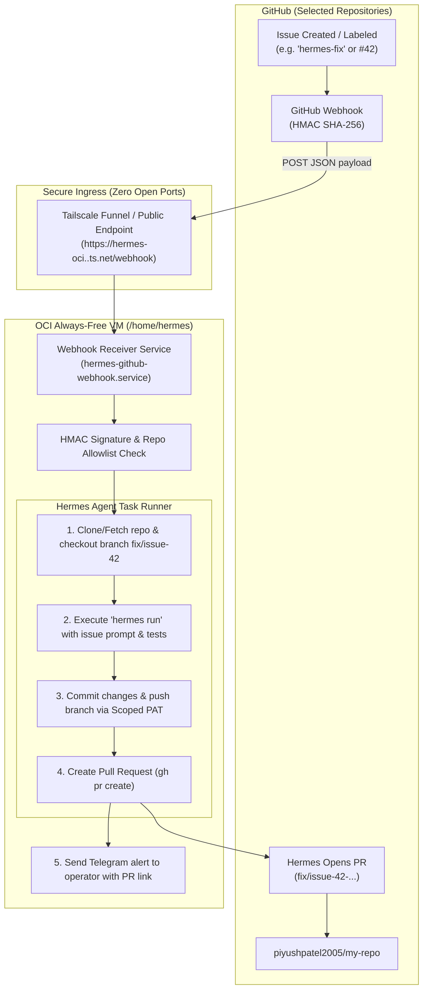
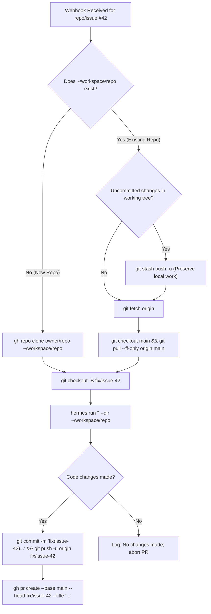

# Automated GitHub Bug-Fixing & PR Workflows with OCI Hermes

This guide provides a complete blueprint and implementation for automating bug fixes and code improvements with your **OCI Hermes Agent**. When an issue or PR is created (or labeled) on selected GitHub repositories, a webhook securely triggers Hermes on your OCI VM to reproduce the issue, write code changes, create a git branch, and submit a Pull Request back for your review.

---

## Architecture & End-to-End Flow



---

## Prerequisites

1. **GitHub Fine-Grained PAT**: Token with `Contents: Read and write` and `Pull requests: Read and write` for the selected repositories (see [docs/managing-repos.md](managing-repos.md)).
2. **GitHub CLI (`gh`)**: Installed and authenticated on the VM (`gh auth status`).
3. **Tailscale Funnel** (or GitHub Actions trigger) to deliver webhooks securely from GitHub to your private OCI instance.
4. **Hermes CLI**: Configured and working on the VM (`hermes --version`).

## Workspace Preservation & Safe Branch Lifecycle

If you already have cloned repositories in `/home/hermes/workspace/`, the automation handles them safely **without deleting or re-cloning**:



### Key Safety Guarantees:
1. **Zero Data Loss**: Existing repositories are **never deleted**. Local configuration files, `.env` files, and custom test setups in `/home/hermes/workspace/<repo>/` remain completely intact.
2. **Uncommitted Work Protection**: If you are actively modifying files in that directory, the daemon runs `git stash push -u` to save your work before pulling upstream changes.
3. **Dedicated Branch Isolation**: All bug-fixing edits and automated tests happen on a fresh branch (`fix/issue-<number>`), ensuring your local `main` branch is untouched.
4. **Dynamic Base Branch Detection**: Automatically detects whether the repository default branch is `main`, `master`, or a custom branch.

---

## Step 1: Webhook Ingress (Tailscale Funnel)

Because your VM has no public ports open, enable **Tailscale Funnel** for a dedicated local webhook receiver port (e.g. port `8080`):

1. SSH into the OCI VM:

```bash
ssh hermes@hermes-oci.<your-tailnet>.ts.net
```

2. Grant the `hermes` user permission to manage Tailscale without `sudo` (one-time setup):

```bash
sudo tailscale set --operator=hermes
```

3. Enable Tailscale Funnel on port `8080`:

```bash
tailscale funnel --bg 8080
```
*(Or run with `sudo`: `sudo tailscale funnel --bg 8080`)*.

4. Tailscale will assign a public HTTPS URL:

```text
https://hermes-oci.<your-tailnet>.ts.net
```
GitHub webhooks sent to `https://hermes-oci.<your-tailnet>.ts.net/webhook` will be securely tunneled to `localhost:8080` on your VM.

> [!NOTE]
> **If Tailscale Funnel is denied by policy**:
> 1. Ensure **HTTPS Certificates** and **MagicDNS** are enabled in the [Tailscale Admin Console](https://login.tailscale.com/admin/dns) $\rightarrow$ **DNS**.
> 2. Ensure your Tailscale ACL allows Funnel under [Access Controls](https://login.tailscale.com/admin/acls):
>    ```json
>    "nodeAttrs": [
>      {
>        "target": ["autogroup:member", "tag:hermes"],
>        "attr": ["funnel"]
>      }
>    ]
>    ```

---

## Step 2: Implement the Webhook Receiver Service

Create a lightweight Python webhook receiver daemon on the VM that:
1. Validates the GitHub HMAC SHA-256 signature (`X-Hub-Signature-256`).
2. Checks if the repository is in your allowed list.
3. Checks if the trigger condition is met (e.g., issue labeled `hermes-fix` or new issue/PR opened).
4. Launches the autonomous Hermes bugfix pipeline in the background.

Create `/home/hermes/scripts/hermes-github-webhook.py`:

```python
#!/usr/bin/env python3
"""
GitHub Webhook Daemon for Autonomous Hermes Bug-Fixing Pipeline
Listens on localhost:8080, verifies HMAC signatures, and launches Hermes workflows.
"""

import os
import hmac
import hashlib
import json
import shutil
import subprocess
import threading
from http.server import HTTPServer, BaseHTTPRequestHandler

# Ensure user PATH and virtualenv binaries are accessible in non-interactive / systemd environments
user_home = os.path.expanduser("~")
extra_bin_paths = [
    os.path.join(user_home, ".local", "bin"),
    os.path.join(user_home, ".hermes", "hermes-agent", "venv", "bin"),
    os.path.join(user_home, ".hermes", "bin"),
    "/usr/local/bin",
    "/usr/bin",
    "/bin"
]
current_path = os.environ.get("PATH", "")
os.environ["PATH"] = os.pathsep.join([p for p in extra_bin_paths if p] + [current_path])

# Propagate GitHub Personal Access Token to standard GH_TOKEN / GITHUB_TOKEN for gh CLI
github_pat = (
    os.getenv("GITHUB_PERSONAL_ACCESS_TOKEN")
    or os.getenv("GH_TOKEN")
    or os.getenv("GITHUB_TOKEN")
)
if github_pat:
    os.environ["GH_TOKEN"] = github_pat
    os.environ["GITHUB_TOKEN"] = github_pat

# Configuration (loaded from ~/.hermes/.env or environment)
WEBHOOK_SECRET = os.getenv("GITHUB_WEBHOOK_SECRET", "your-webhook-secret-token")
WEBHOOK_PORT = int(os.getenv("WEBHOOK_PORT", "8080"))
ALLOWED_REPOS = [
    repo.strip()
    for repo in os.getenv("HERMES_ALLOWED_REPOS", "piyushpatel2005/tutorial-k8s,piyushpatel2005/tutorial-python").split(",")
]
WORKSPACE_DIR = os.path.expanduser(os.getenv("HERMES_WORKSPACE_DIR", "~/workspace"))
LOG_DIR = os.path.expanduser(os.getenv("HERMES_LOG_DIR", "~/.hermes/logs"))

os.makedirs(WORKSPACE_DIR, exist_ok=True)
os.makedirs(LOG_DIR, exist_ok=True)


def ensure_gh_authenticated():
    """Idempotently ensures GitHub CLI is logged in and git credential helper is configured."""
    token = (
        os.getenv("GITHUB_PERSONAL_ACCESS_TOKEN")
        or os.getenv("GH_TOKEN")
        or os.getenv("GITHUB_TOKEN")
    )
    if not token:
        print("[Webhook Auth] Notice: No GitHub token found in environment.", flush=True)
        return

    # Check if gh CLI is already authenticated
    auth_check = subprocess.run(["gh", "auth", "status"], capture_output=True, text=True)
    if auth_check.returncode != 0:
        print("[Webhook Auth] Authenticating gh CLI using environment token...", flush=True)
        login_res = subprocess.run(
            ["gh", "auth", "login", "--with-token"],
            input=token,
            capture_output=True,
            text=True
        )
        if login_res.returncode == 0:
            print("[Webhook Auth] Successfully authenticated gh CLI.", flush=True)
            subprocess.run(["gh", "auth", "setup-git"], capture_output=True, text=True)
        else:
            print(f"[Webhook Auth] Warning: gh login failed: {login_res.stderr.strip()}", flush=True)
    else:
        # Ensure git helper is configured
        subprocess.run(["gh", "auth", "setup-git"], capture_output=True, text=True)


class ReusableHTTPServer(HTTPServer):
    """HTTPServer subclass that enables socket SO_REUSEADDR for rapid service restarts."""
    allow_reuse_address = True


def verify_signature(payload: bytes, signature_header: str) -> bool:
    if not signature_header or not signature_header.startswith("sha256="):
        return False
    expected = hmac.new(
        WEBHOOK_SECRET.encode("utf-8"), payload, hashlib.sha256
    ).hexdigest()
    return hmac.compare_digest(f"sha256={expected}", signature_header)


def get_default_branch(repo_dir: str) -> str:
    """Detects whether origin uses 'main', 'master', or a custom default branch."""
    try:
        res = subprocess.run(
            ["git", "-C", repo_dir, "symbolic-ref", "refs/remotes/origin/HEAD"],
            capture_output=True,
            text=True,
            check=True
        )
        return res.stdout.strip().split("/")[-1]
    except Exception:
        return "main"


def run_hermes_bugfix(repo_full_name: str, issue_number: int, issue_title: str, issue_body: str, issue_url: str):
    """
    Executes the full branch creation, bug fixing, test running, and PR opening pipeline.
    Safe for existing repositories in ~/workspace/: preserves existing work, pulls latest,
    and isolates bug fixes strictly inside a dedicated branch.
    """
    repo_name = repo_full_name.split("/")[-1]
    repo_dir = os.path.join(WORKSPACE_DIR, repo_name)
    branch_name = f"fix/issue-{issue_number}"
    log_file = os.path.join(LOG_DIR, f"webhook-task-issue-{issue_number}.log")

    with open(log_file, "a") as log:
        log.write(f"\n=======================================================\n")
        log.write(f"[{repo_full_name}] Processing Issue #{issue_number}: {issue_title}\n")
        log.write(f"Directory: {repo_dir} | Target Branch: {branch_name}\n")
        log.write(f"=======================================================\n\n")

        # 1. Clone repository if absent; preserve if present
        if not os.path.exists(os.path.join(repo_dir, ".git")):
            log.write(f"Repository not found locally. Cloning {repo_full_name} into {repo_dir}...\n")
            clone_res = subprocess.run(["gh", "repo", "clone", repo_full_name, repo_dir], stdout=log, stderr=log)
            if clone_res.returncode != 0:
                log.write(f"ERROR: Failed to clone repository {repo_full_name} (exit code {clone_res.returncode}). Check gh auth/token.\n")
                return
        else:
            log.write(f"Existing repository detected at {repo_dir}. Preserving local repo.\n")

        # 2. Check for any uncommitted operator changes and stash safely
        dirty_check = subprocess.run(
            ["git", "-C", repo_dir, "status", "--porcelain"],
            capture_output=True,
            text=True
        ).stdout.strip()

        stashed = False
        if dirty_check:
            log.write("Uncommitted changes detected in local repo. Stashing safely before update...\n")
            subprocess.run(
                ["git", "-C", repo_dir, "stash", "push", "-u", "-m", f"Auto-stash before Hermes fix issue #{issue_number}"],
                stdout=log,
                stderr=log
            )
            stashed = True

        # 3. Fetch latest upstream commits and determine default branch (main/master)
        log.write("Fetching latest updates from origin...\n")
        subprocess.run(["git", "-C", repo_dir, "fetch", "origin"], stdout=log, stderr=log)
        default_branch = get_default_branch(repo_dir)

        # 4. Checkout fresh default branch and pull latest changes
        log.write(f"Checking out and fast-forwarding base branch '{default_branch}'...\n")
        subprocess.run(["git", "-C", repo_dir, "checkout", default_branch], stdout=log, stderr=log)
        subprocess.run(["git", "-C", repo_dir, "pull", "--ff-only", "origin", default_branch], stdout=log, stderr=log)

        # 5. Create and switch to the dedicated bugfix branch
        log.write(f"Creating and switching to clean branch '{branch_name}'...\n")
        subprocess.run(["git", "-C", repo_dir, "checkout", "-B", branch_name], stdout=log, stderr=log)

        # 6. Formulate Hermes autonomous bugfix prompt
        prompt = (
            f"You are resolving Issue #{issue_number} in repository {repo_full_name}.\n"
            f"Title: {issue_title}\n\n"
            f"Description / Request:\n{issue_body}\n\n"
            f"Instructions:\n"
            f"1. Search repository files (markdown, source code, lesson files) to locate text, code, or permalinks referenced in the issue.\n"
            f"2. Apply the requested edits (e.g. reformatting paragraph instructions into bulleted lists, fixing bugs, or updating documentation).\n"
            f"3. Run existing tests or linter checks if present to verify your changes.\n"
            f"4. Ensure your edits are clean and no stray temporary files are left behind."
        )

        hermes_bin = shutil.which("hermes")
        log.write(f"Resolved Hermes binary: {hermes_bin}\n")
        log.write("Invoking Hermes Agent autonomously...\n")

        if not hermes_bin:
            log.write("ERROR: 'hermes' binary not found in PATH. Verify Hermes CLI installation.\n")
            hermes_exit_code = 127
        else:
            # Hermes one-shot autonomous execution (-z / --oneshot auto-bypasses approvals for scripts)
            hermes_cmd = [
                hermes_bin,
                "-z", prompt,
                "--in", repo_dir,
                "--yolo",
                "--accept-hooks"
            ]
            hermes_run = subprocess.run(
                hermes_cmd,
                cwd=repo_dir,
                stdout=log,
                stderr=log
            )
            hermes_exit_code = hermes_run.returncode
            log.write(f"Hermes execution completed with exit code: {hermes_exit_code}\n")

        # 7. Verify changes made by Hermes
        status = subprocess.run(
            ["git", "-C", repo_dir, "status", "--porcelain"],
            capture_output=True,
            text=True
        ).stdout.strip()

        if not status:
            log.write("No code changes produced by Hermes. Posting feedback comment on issue...\n")
            comment_body = (
                f"🤖 **Hermes Agent Status Update**\n\n"
                f"Hermes analyzed Issue #{issue_number} in `{repo_full_name}`, but no automated code edits were produced "
                f"(exit code: `{hermes_exit_code}`).\n\n"
                f"**Tips**:\n"
                f"- Ensure the issue specifies the exact file path or lesson file name to be modified.\n"
                f"- Check server task logs at `~/.hermes/logs/webhook-task-issue-{issue_number}.log` for details."
            )
            comment_res = subprocess.run(
                ["gh", "issue", "comment", str(issue_number), "--repo", repo_full_name, "--body", comment_body],
                stdout=log,
                stderr=log
            )
            log.write(f"gh issue comment exit code: {comment_res.returncode}\n")
            if comment_res.returncode != 0:
                log.write("WARNING: Failed to post GitHub issue comment. Check 'gh auth status' and verify token has 'Issues: Read and write' permissions.\n")
            return

        # 8. Commit and push the branch to GitHub
        log.write(f"Committing changes to branch '{branch_name}' and pushing to origin...\n")
        subprocess.run(["git", "-C", repo_dir, "add", "-A"], stdout=log, stderr=log)
        commit_msg = (
            f"fix(issue-{issue_number}): {issue_title}\n\n"
            f"Automated bug fix generated by Hermes Agent on OCI.\n"
            f"Resolves #{issue_number}"
        )
        subprocess.run(["git", "-C", repo_dir, "commit", "-m", commit_msg], stdout=log, stderr=log)
        subprocess.run(["git", "-C", repo_dir, "push", "-u", "origin", branch_name, "--force"], stdout=log, stderr=log)

        # 9. Create the Pull Request back on GitHub
        pr_body = (
            f"## Automated Fix for Issue #{issue_number}\n\n"
            f"**Issue**: [{issue_title}]({issue_url})\n\n"
            f"### Description of Changes\n"
            f"This Pull Request was autonomously created by **Hermes Agent on OCI** to resolve issue #{issue_number}.\n\n"
            f"- Base branch: `{default_branch}`\n"
            f"- Fix branch: `{branch_name}`\n\n"
            f"Closes #{issue_number}"
        )
        log.write("Submitting Pull Request via GitHub CLI...\n")
        pr_res = subprocess.run(
            [
                "gh", "pr", "create",
                "--repo", repo_full_name,
                "--base", default_branch,
                "--head", branch_name,
                "--title", f"fix(issue-{issue_number}): {issue_title}",
                "--body", pr_body
            ],
            capture_output=True,
            text=True
        )
        log.write(f"PR Result: {pr_res.stdout} {pr_res.stderr}\n")


class WebhookHandler(BaseHTTPRequestHandler):
    def do_POST(self):
        if self.path != "/webhook":
            self.send_response(404)
            self.end_headers()
            return

        content_length = int(self.headers.get("Content-Length", 0))
        body = self.rfile.read(content_length)

        sig = self.headers.get("X-Hub-Signature-256", "")
        if not verify_signature(body, sig):
            self.send_response(403)
            self.end_headers()
            self.wfile.write(b"Forbidden: Invalid Signature")
            return

        event = self.headers.get("X-GitHub-Event", "")
        payload = json.loads(body.decode("utf-8"))

        # Process Issues (opened, edited, or labeled 'hermes-fix')
        if event == "issues":
            action = payload.get("action")
            issue = payload.get("issue", {})
            repo = payload.get("repository", {}).get("full_name")
            labels = [lbl.get("name") for lbl in issue.get("labels", [])]

            print(f"[Webhook] Event 'issues' (action='{action}') received for repo '{repo}'", flush=True)

            if repo not in ALLOWED_REPOS:
                print(f"[Webhook] Ignored: repo '{repo}' is not in HERMES_ALLOWED_REPOS: {ALLOWED_REPOS}", flush=True)
                self.send_response(200)
                self.end_headers()
                self.wfile.write(f"Ignored: Repo {repo} not in allowlist".encode("utf-8"))
                return

            # Trigger on opened/edited issue, or when 'hermes-fix' label is present/added
            is_labeled_hermes = (action == "labeled" and payload.get("label", {}).get("name") == "hermes-fix") or ("hermes-fix" in labels)
            if action in ("opened", "edited") or is_labeled_hermes:
                issue_num = issue.get("number")
                title = issue.get("title")
                desc = issue.get("body") or ""
                url = issue.get("html_url")

                print(f"[Webhook] Launching Hermes task for issue #{issue_num} on {repo}...", flush=True)

                # Run asynchronous task in background thread
                thread = threading.Thread(
                    target=run_hermes_bugfix,
                    args=(repo, issue_num, title, desc, url)
                )
                thread.start()

                self.send_response(202)
                self.end_headers()
                self.wfile.write(b"Accepted: Hermes task started")
                return
            else:
                print(f"[Webhook] Ignored issue action '{action}' (not opened/edited/labeled hermes-fix)", flush=True)

        self.send_response(200)
        self.end_headers()
        self.wfile.write(b"OK: Event ignored")


if __name__ == "__main__":
    try:
        ensure_gh_authenticated()
        server = ReusableHTTPServer(("127.0.0.1", WEBHOOK_PORT), WebhookHandler)
        print(f"Hermes GitHub Webhook receiver listening on 127.0.0.1:{WEBHOOK_PORT}...")
        server.serve_forever()
    except Exception as e:
        print(f"Failed to start webhook server on port {WEBHOOK_PORT}: {e}", flush=True)
        raise
```

---

## Step 3: Run as a Systemd Background Service

1. Create the systemd service file on the VM using `sudo` (e.g. from your `ubuntu` or `hermes` SSH session with sudo privileges):

```bash
sudo tee /etc/systemd/system/hermes-github-webhook.service > /dev/null <<'EOF'
[Unit]
Description=Hermes GitHub Webhook Listener
After=network.target tailscaled.service

[Service]
Type=simple
User=hermes
Group=hermes
WorkingDirectory=/home/hermes
Environment=PATH=/home/hermes/.local/bin:/home/hermes/.hermes/hermes-agent/venv/bin:/home/hermes/.hermes/bin:/usr/local/sbin:/usr/local/bin:/usr/sbin:/usr/bin:/sbin:/bin
EnvironmentFile=-/home/hermes/.hermes/.env
ExecStart=/usr/bin/python3 /home/hermes/scripts/hermes-github-webhook.py
Restart=always
RestartSec=5

[Install]
WantedBy=multi-user.target
EOF
```

*(Note: The service file is also tracked in the repo at [`systemd/hermes-github-webhook.service`](../systemd/hermes-github-webhook.service)).*

2. Add your webhook configuration to `/home/hermes/.hermes/.env`:

```env
# GitHub Webhook Configuration
GITHUB_WEBHOOK_SECRET="generate-a-strong-random-token-here"
HERMES_ALLOWED_REPOS="piyushpatel2005/tutorial-k8s,piyushpatel2005/tutorial-python"
```

3. Enable and start the service:

```bash
sudo systemctl daemon-reload
sudo systemctl enable --now hermes-github-webhook.service
sudo systemctl status hermes-github-webhook.service
```

---

## Step 4: Configure the Webhook in GitHub

1. Open your GitHub repository in your browser (e.g. `https://github.com/piyushpatel2005/tutorial-k8s`).
2. Go to **Settings** $\rightarrow$ **Webhooks** $\rightarrow$ **Add webhook**.
3. Fill in the parameters:
   - **Payload URL**: `https://hermes-oci.<your-tailnet>.ts.net/webhook`
   - **Content type**: `application/json`
   - **Secret**: *(The string you set in `GITHUB_WEBHOOK_SECRET`)*
   - **SSL verification**: `Enable SSL verification`
   - **Which events would you like to trigger this webhook?**:
     Select **"Let me select individual events"** and check:
     - [x] **Issues** *(triggers Hermes on issue creation)*
     - [x] **Issue comments** *(triggers Hermes on PR timeline comments)*
     - [x] **Pull requests** *(tracks PR lifecycle)*
     - [x] **Pull request review comments** *(triggers Hermes on inline diff review comments)*
     - [x] **Pull request reviews** *(triggers Hermes when changes are requested)*
4. Click **Add webhook** (or **Update webhook**).

---

## Step 5: Test the Workflow

1. Go to your repository and open a new Issue:
   - **Title**: `Fix broken navigation link in header`
   - **Description**: `The header link for 'Documentation' points to /doc instead of /docs.`
   - **Labels**: Add label `hermes-fix` (or leave default if configured to trigger on open).
2. Watch the execution in real-time on your VM:

```bash
# Follow the webhook daemon logs
journalctl -u hermes-github-webhook.service -f

# Follow the specific task run log
tail -f ~/.hermes/logs/webhook-task-issue-*.log
```

3. Within 1–2 minutes, Hermes will:
   - Create branch `fix/issue-<num>`.
   - Edit the relevant source files and run local verification.
   - Push the branch and open a Pull Request on GitHub: `fix(issue-<num>): Fix broken navigation link in header`.

---

## Alternative: Serverless GitHub Actions Trigger (Zero Ingress)

If you prefer not running a continuous webhook listener daemon, you can trigger Hermes on OCI via a **GitHub Action workflow** using Tailscale's official GitHub Action step:

```yaml
# .github/workflows/hermes-agent-fix.yml
name: Hermes Agent Bug Fix

on:
  issues:
    types: [labeled]

jobs:
  trigger-hermes:
    if: github.event.label.name == 'hermes-fix'
    runs-on: ubuntu-latest
    steps:
      - name: Connect to Tailscale
        uses: tailscale/github-action@v2
        with:
          oauth-client-id: ${{ secrets.TS_OAUTH_CLIENT_ID }}
          oauth-secret: ${{ secrets.TS_OAUTH_SECRET }}
          tags: tag:ci

      - name: SSH and Run Hermes Fix
        run: |
          ssh -o StrictHostKeyChecking=no hermes@hermes-oci \
            "hermes run 'Fix issue #${{ github.event.issue.number }}: ${{ github.event.issue.title }}' --dir ~/workspace/${{ github.event.repository.name }}"
```

---

## Safety Guardrails & Best Practices

1. **Strict Repo Allowlist**: Always keep `HERMES_ALLOWED_REPOS` restricted so webhooks from unexpected repositories are discarded immediately.
2. **Never Auto-Merge**: Always require human PR review before merging code produced by Hermes.
3. **Branch Isolation**: Ensure Hermes always creates PR branches (`fix/issue-...`) and never pushes directly to `main`.
4. **Fine-Grained PAT Scopes**: Limit the PAT tokens stored on the VM to `Contents: Read & write` and `Pull requests: Read & write` only.

---

## See Also

- [docs/managing-repos.md](managing-repos.md) — Managing repositories and scoping fine-grained access.
- [docs/remote-access.md](remote-access.md) — Viewing and editing remote files in VS Code / Antigravity.
- [docs/channels.md](channels.md) — Telegram and gateway integrations.
- [docs/RUNBOOK.md](RUNBOOK.md) — Main operational runbook.
