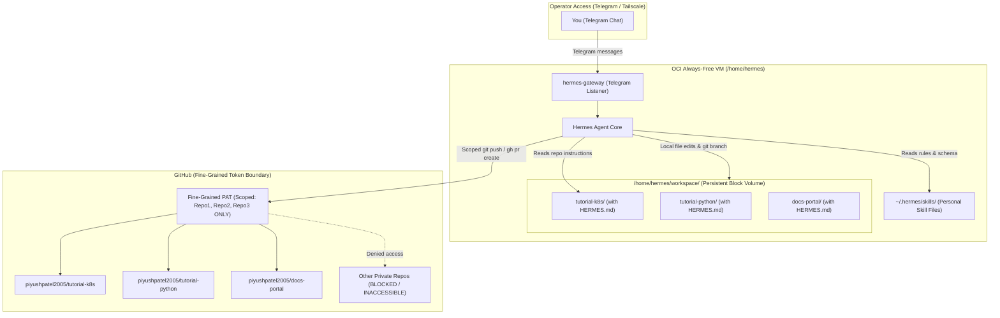
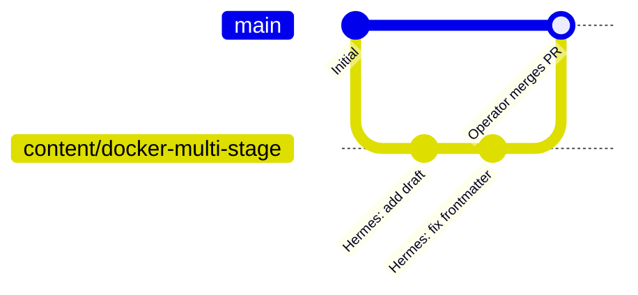

# Managing Repositories & Content Authoring with OCI Hermes

This guide explains how to safely connect your **OCI Hermes Agent** to specific content repositories (e.g., tutorial and documentation repos), enforce **least-privilege repository scoping**, configure **personal skills and frontmatter validation rules**, and trigger content workflows over **Telegram** or the **CLI**.

---

## Architecture & Security Boundary



---

## Step 1: Restrict Access to Specific Repositories

To ensure Hermes can **only** read and write to your tutorial repositories and cannot access any other personal or organizational repositories, use a **GitHub Fine-Grained Personal Access Token (PAT)** or **Per-Repository Deploy Keys**.

### Option A: GitHub Fine-Grained Personal Access Token (Recommended)

GitHub Fine-Grained PATs provide repository-level isolation and granular permission boundaries.

1. Go to GitHub: **Settings** → **Developer Settings** → **Personal Access Tokens** → **[Fine-grained tokens](https://github.com/settings/tokens?type=beta)**.
2. Click **Generate new token**.
3. Configure the token:
   - **Token name**: `hermes-oci-content-repos`
   - **Expiration**: Select your preferred rotation schedule (e.g. 90 days or 1 year).
   - **Resource owner**: Select your user account or target organization.
   - **Repository access**: Select **"Only select repositories"** and check **only** the content repositories Hermes needs to manage (e.g., `tutorial-k8s`, `tutorial-python`, `docs-portal`).
4. Set **Repository Permissions**:
   | Permission | Level | Rationale |
   |---|---|---|
   | **Contents** | `Read and write` | Allows cloning, reading files, committing, and pushing branch updates. |
   | **Pull requests** | `Read and write` | Allows Hermes to open and manage PRs for your review. |
   | **Issues** | `Read and write` *(Optional)* | Allows managing content issue trackers or task tickets. |
   | **Metadata** | `Read-only` | Mandatory default for GitHub API integration. |
   | **All Other Permissions** | `No access` | Leaves Actions, Administration, Secrets, Webhooks, etc. completely blocked. |
5. Click **Generate token** and copy the resulting `github_pat_...` string.

> [!CAUTION]
> Do **not** use a classic Personal Access Token (`repo` scope) or select "All repositories". A fine-grained PAT guarantees that even if the agent is prompted to explore other repositories, GitHub API and git push will reject the request.

---

### Option B: Per-Repository Deploy Keys (Strict SSH Isolation)

If you prefer per-repository SSH key pairs with no shared token:

1. SSH into the OCI instance:
   ```sh
   ssh hermes@hermes-oci.<your-tailnet>.ts.net
   ```
2. Generate an SSH key pair specifically for a content repo:
   ```sh
   ssh-keygen -t ed25519 -C "hermes-tutorial-k8s" -f ~/.ssh/id_tutorial_k8s -N ""
   ```
3. Add the public key to GitHub:
   - In GitHub, navigate to the target repository → **Settings** → **Deploy Keys** → **Add deploy key**.
   - Paste `~/.ssh/id_tutorial_k8s.pub` and check **"Allow write access"**.
4. Configure `~/.ssh/config` on the VM:
   ```ssh-config
   Host github-tutorial-k8s
     HostName github.com
     User git
     IdentityFile ~/.ssh/id_tutorial_k8s
     IdentitiesOnly yes
   ```
5. Clone using the host alias:
   ```sh
   git clone git@github-tutorial-k8s:piyushpatel2005/tutorial-k8s.git /home/hermes/workspace/tutorial-k8s
   ```

---

## Step 2: Configure Credentials & Clone Repositories on OCI Hermes

Connect to your OCI VM over Tailscale SSH:

```sh
ssh hermes@hermes-oci.<your-tailnet>.ts.net
```

### 1. Configure the Scoped Token in Hermes

Edit `/home/hermes/.hermes/.env` (or pass it through OCI Vault):

```sh
nano /home/hermes/.hermes/.env
```

Set the token:

```env
# Fine-grained PAT scoped strictly to content repos
GITHUB_PERSONAL_ACCESS_TOKEN="github_pat_11ABCD..."
```

Authenticate the `gh` CLI for Hermes:

```sh
echo "$GITHUB_PERSONAL_ACCESS_TOKEN" | gh auth login --with-token
gh auth status
```

### 2. Configure Git Identity for the Hermes User

Ensure commits made by Hermes have an identifiable author signature:

```sh
git config --global user.name "Hermes Content Agent"
git config --global user.email "hermes-agent@users.noreply.github.com"
git config --global init.defaultBranch main
```

### 3. Clone the Target Repositories into the Workspace

All persistent project data lives under `/home/hermes/workspace/` (mounted on the 100 GB block volume).

```sh
mkdir -p /home/hermes/workspace
cd /home/hermes/workspace

# Clone only the authorized content repositories
gh repo clone piyushpatel2005/tutorial-k8s
gh repo clone piyushpatel2005/tutorial-python
gh repo clone piyushpatel2005/docs-portal
```

Verify the layout:

```sh
ls -la /home/hermes/workspace
```

---

## Step 3: Teach Hermes Your Frontmatter & Repository Standards

Hermes learns rules and conventions through two complementary mechanisms:
1. **Global/Personal Skills (`~/.hermes/skills/`)**: Teaches authoring workflows, YAML frontmatter schemas, and validation routines across all content tasks.
2. **Repository-Level Instruction Files (`HERMES.md` or `AGENTS.md`)**: Teaches repo-specific directory layouts, required assets, and static site generator requirements.

---

### 1. Create a Personal Content Authoring Skill

Create a dedicated skill directory:

```sh
mkdir -p /home/hermes/.hermes/skills/content-authoring
```

Create `/home/hermes/.hermes/skills/content-authoring/SKILL.md`:

```markdown
---
name: content-authoring
description: Standards, frontmatter schemas, and file structure rules for authoring tutorial posts and documentation.
---

# Content Authoring & Frontmatter Guidelines

Use this skill whenever creating, modifying, or reviewing markdown/MDX tutorial content in `/home/hermes/workspace/*`.

## 1. Mandatory Frontmatter Schema

Every tutorial document must begin with valid YAML frontmatter enclosed by `---`.

### Standard Schema Fields

| Field | Type | Required | Description | Example |
|---|---|---|---|---|
| `title` | string | **Yes** | Clear, action-oriented title (< 65 chars) | `"Getting Started with Kubernetes Namespaces"` |
| `description` | string | **Yes** | 1–2 sentence SEO summary (< 160 chars) | `"Learn how Kubernetes namespaces isolate resources and workloads."` |
| `date` | string (ISO 8601) | **Yes** | Publication date (`YYYY-MM-DD`) | `"2026-09-24"` |
| `lastModified` | string (ISO 8601) | No | Last revised date (`YYYY-MM-DD`) | `"2026-09-24"` |
| `tags` | array of strings | **Yes** | 2–5 lowercase topical tags | `["kubernetes", "devops", "containers"]` |
| `categories` | array of strings | **Yes** | Primary category | `["Cloud Native"]` |
| `series` | string | No | Series title if part of a multi-part guide | `"Kubernetes Zero to Hero"` |
| `seriesOrder` | integer | No | 1-indexed order within the series | `3` |
| `difficulty` | string | **Yes** | `beginner`, `intermediate`, or `advanced` | `"intermediate"` |
| `draft` | boolean | **Yes** | Set `true` while in progress; `false` when ready | `true` |
| `author` | string | **Yes** | Author name | `"Piyush Patel"` |

### Frontmatter Template Example

```yaml
---
title: "Understanding Kubernetes Pod Disruption Budgets"
description: "A practical guide to keeping your services resilient during voluntary node disruptions with PDBs."
date: "2026-09-24"
lastModified: "2026-09-24"
tags:
  - kubernetes
  - reliability
  - devops
categories:
  - Infrastructure
series: "Kubernetes Production Patterns"
seriesOrder: 4
difficulty: "intermediate"
draft: true
author: "Piyush Patel"
---
```

## 2. Content Quality & Formatting Rules

1. **Heading Hierarchy**:
   - Do **not** repeat the H1 title in the body (the static site generator renders the frontmatter `title` as H1).
   - Start section headers with `##` (H2) and sub-sections with `###` (H3).
2. **Code Blocks**:
   - Always specify the language identifier (e.g. ` ```bash `, ` ```yaml `, ` ```python `).
   - Include realistic file paths or context comments when providing configuration files.
3. **Internal Links & Assets**:
   - Place post-specific images in the repository's assets directory (e.g., `./assets/` or `/static/images/<slug>/`).
   - Use descriptive alt text for all diagrams and screenshots.
4. **Validation Step**:
   - Before finishing any task, parse and verify that all required frontmatter keys are present and non-empty.
```

---

### 2. Add Repository-Specific `HERMES.md` / `AGENTS.md` Files

In each content repository under `/home/hermes/workspace/<repo-name>/`, place a `HERMES.md` file in the root directory. When Hermes works within a repository, it reads this file for repo-specific rules.

#### Example: `/home/hermes/workspace/tutorial-k8s/HERMES.md`

```markdown
# Repository Guide: tutorial-k8s

This repository powers the Kubernetes Tutorial series published with Hugo/Astro.

## Directory Layout
- `content/posts/`: Main tutorial posts in markdown format.
- `content/series/`: Series overview index pages.
- `static/diagrams/`: SVG architecture diagrams.
- `code-samples/`: Working, tested YAML manifests used in tutorials.

## Workflow Rules for Hermes
1. **Branching**: Never commit directly to `main`. Create a branch named `content/<topic-slug>`.
2. **Testing Manifests**: When adding YAML snippets in `code-samples/`, run `kubectl --dry-run=client -f <file>` or validate YAML syntax.
3. **Frontmatter**: Follow the standard schema from the `content-authoring` skill.
4. **Pull Requests**: Once the draft is written, run `gh pr create` with labels `documentation` and `content-draft`.
```

#### Example: `/home/hermes/workspace/tutorial-python/HERMES.md`

```markdown
# Repository Guide: tutorial-python

This repository contains Python tutorial articles and interactive Jupyter notebooks.

## Directory Layout
- `tutorials/`: Markdown guides.
- `notebooks/`: Accompanying `.ipynb` files.
- `tests/`: Pytest scripts validating tutorial code snippets.

## Workflow Rules for Hermes
1. When creating a new Python tutorial, write the code sample to `tests/test_<topic>.py` and ensure `pytest` passes.
2. Embed the verified code snippets into `tutorials/<topic>.md`.
3. Fill in all required frontmatter fields (`title`, `description`, `tags`, `difficulty`, `draft: true`).
```

---

## Step 4: Operating Hermes via Telegram

With `hermes-gateway.service` active and connected to your Telegram bot (see [channels.md](file:///Users/piyush.patel/IdeaProjects/agentic-infra/docs/channels.md)), you can manage your repositories directly from your phone or desktop.

### Example Telegram Interactions

#### 1. Creating a New Tutorial Draft
```text
You:
In /home/hermes/workspace/tutorial-k8s, create a new tutorial post about "Kubernetes Init Containers with ConfigMaps". Apply the content-authoring skill frontmatter rules. Put it in a new branch content/init-containers.

Hermes:
I have created branch `content/init-containers` in `/home/hermes/workspace/tutorial-k8s`.
Created `content/posts/2026-09-24-k8s-init-containers.md` with full frontmatter:
- Title: "Using Kubernetes Init Containers with Dynamic ConfigMaps"
- Tags: [kubernetes, containers, devops]
- Difficulty: intermediate
- Draft: true

Would you like me to commit and push this branch to open a Pull Request?
```

#### 2. Auditing Existing Frontmatters
```text
You:
Check all markdown files in /home/hermes/workspace/tutorial-python/tutorials/ and verify whether any posts are missing required frontmatter fields or have draft set to false without a valid description.

Hermes:
Scanned 14 files in `tutorial-python/tutorials/`:
- `tutorials/asyncio-queues.md`: Missing required `difficulty` field.
- `tutorials/fastapi-middleware.md`: OK.
- `tutorials/uv-package-manager.md`: OK.

I can automatically patch `asyncio-queues.md` with `difficulty: "intermediate"`. Should I proceed?
```

#### 3. Opening a PR After Review
```text
You:
Commit all changes in tutorial-k8s with message "Add init containers tutorial draft" and create a pull request to main.

Hermes:
Committed changes (commit hash `a1b2c3d`).
Pushed branch `content/init-containers` to origin.
Created PR #42: "Add init containers tutorial draft"
URL: https://github.com/piyushpatel2005/tutorial-k8s/pull/42
```

---

## Step 5: Safe Git Branching & Pull Request Strategy

To safeguard your content and prevent accidental overwrites on production branches:



1. **Always Work on Topic Branches**:
   Instruct Hermes to create branches prefixed with `content/` or `hermes/` (e.g. `git checkout -b content/docker-multi-stage`).
2. **Push to Remote**:
   ```sh
   git push -u origin content/docker-multi-stage
   ```
3. **Open a GitHub Pull Request via `gh` CLI**:
   ```sh
   gh pr create \
     --title "Draft: Docker Multi-Stage Builds Tutorial" \
     --body "Automated draft generated by Hermes Agent adhering to content-authoring standards." \
     --draft
   ```
4. **Merge from GitHub UI or Telegram**:
   You review the diff, edit as needed, and merge into `main` when ready.

---

## Step 6: Backup & Mirroring Integration

Repositories in `/home/hermes/workspace/` are automatically protected by two built-in subsystems:

1. **Daily Encrypted Object Storage Backups (`hermes-backup.service`)**:
   - Archives `/home/hermes/workspace/` daily (excluding build caches like `.venv`, `node_modules`, `target`), encrypts with `age`, and uploads to OCI Object Storage with 14-day retention.
2. **Nightly GitHub Mirroring (`hermes-git-mirror.service`)**:
   - Automatically iterates over `/home/hermes/workspace/*/.git` and runs `git push --mirror` to your designated backup GitHub organization or repository prefix.

---

## Quick Reference & Troubleshooting

### Common Commands for the Operator (over SSH)

| Task | Command |
|---|---|
| Check Git remotes for a repo | `git -C /home/hermes/workspace/tutorial-k8s remote -v` |
| Test GitHub PAT permissions | `gh auth status` |
| List loaded Hermes skills | `hermes skill list` |
| Check Telegram gateway logs | `journalctl -u hermes-gateway -n 50 -f` |
| Run frontmatter audit manually | `hermes run "Verify frontmatters in /home/hermes/workspace/tutorial-k8s"` |

### Troubleshooting Scenarios

1. **`gh: Resource not accessible by personal access token`**:
   - **Cause**: The fine-grained PAT is missing `Contents: Read and write` or `Pull requests: Read and write` permissions, or the repository was not added to the token's allowed list.
   - **Fix**: Update token permissions on GitHub under **Settings → Developer Settings → Fine-grained tokens**.
2. **Hermes creates files with missing frontmatter**:
   - **Cause**: Skill path not loaded or repo `HERMES.md` not detected.
   - **Fix**: Verify `/home/hermes/.hermes/skills/content-authoring/SKILL.md` exists and run `hermes doctor` to ensure the skills directory is recognized.
3. **Git push rejected (Protected branch)**:
   - **Cause**: Attempting to push directly to `main` when branch protection is enabled.
   - **Fix**: Ensure Hermes checks out a feature branch before committing (`git checkout -b content/<feature>`).
