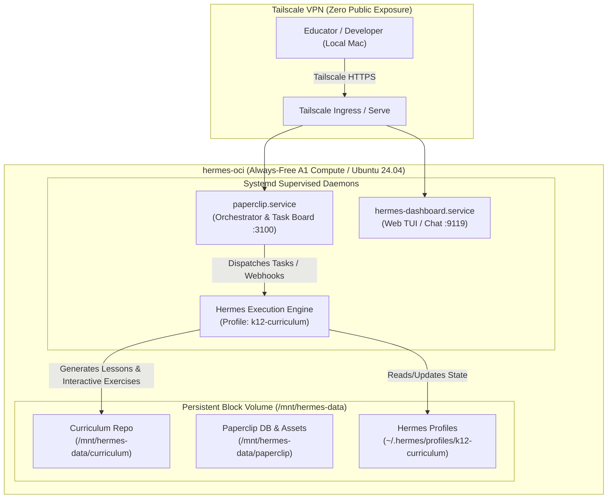
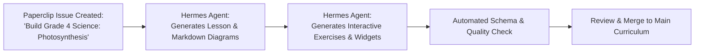

# Paperclip & Hermes K–12 Curriculum Platform Guide

This guide details the end-to-end installation, configuration, and operation of **Paperclip** alongside a dedicated **Hermes Agent profile** on your `hermes-oci` instance.

This setup powers a comprehensive, automated student learning platform spanning **Math, Science, and English** across all grade bands: **JK (Junior Kindergarten), SK (Senior Kindergarten), and Grades 1 through 12 (K1–K12)**.

---

## Table of Contents
1. [Architecture Overview](#1-architecture-overview)
2. [Prerequisites & System Sizing](#2-prerequisites--system-sizing)
3. [Installing Paperclip on `hermes-oci`](#3-installing-paperclip-on-hermes-oci)
4. [Configuring the Dedicated Hermes Profile (`k12-curriculum`)](#4-configuring-the-dedicated-hermes-profile-k12-curriculum)
5. [Curriculum Structure & Interactive Exercise Standards](#5-curriculum-structure--interactive-exercise-standards)
6. [Custom Skills for Hermes](#6-custom-skills-for-hermes)
7. [Paperclip Task Workflow & Automation](#7-paperclip-task-workflow--automation)
8. [Multi-Device Sync & Backups](#8-multi-device-sync--backups)
9. [Verification, Testing & Troubleshooting](#9-verification-testing--troubleshooting)

---

## 1. Architecture Overview



### Key Design Principles
1. **Isolated Profile**: The curriculum generation engine uses its own profile (`k12-curriculum`) with custom system prompts, persona (`SOUL.md`), and guardrails tuned specifically for pedagogy.
2. **Persistent Storage**: All curriculum content, exercises, and Paperclip state live on `/mnt/hermes-data` (the attached 100 GB block volume) to survive instance reboots and redeployments.
3. **Zero Public Attack Surface**: Accessible exclusively through Tailscale (`tailscale serve`).
4. **Interactive-First Pedagogy**: Lessons are paired with interactive exercises, self-checking HTML5/JS widgets, gamified challenges, and tiered difficulty rubrics.

---

## 2. Prerequisites & System Sizing

* **Server**: `hermes-oci` VM (Oracle Cloud A1.Flex ARM64 or AMD64 instance with 100 GB block storage at `/mnt/hermes-data`).
* **Node.js**: v20+ LTS (installed via NodeSource or `fnm`/`nvm`).
* **Python**: 3.11+ (Hermes runtime).
* **Git**: Authenticated with your curriculum GitHub repository.
* **Tailscale**: Active and running on `hermes-oci`.

---

## 3. Installing Paperclip on `hermes-oci`

Paperclip serves as the agent task board, issue tracker, and workflow manager for breaking down curriculum standards into bite-sized authoring jobs.

### Step 3.1: Install Node.js & Dependencies

SSH into your instance:
```bash
ssh ubuntu@hermes-oci  # or tailscale ssh
```

Install Node.js 20 LTS (if not already present):
```bash
if ! command -v node >/dev/null 2>&1; then
  curl -fsSL https://deb.nodesource.com/setup_20.x | sudo -E bash -
  sudo apt-get install -y nodejs
fi

# Verify versions
node -v
npm -v
```

### Step 3.2: Prepare Directories on Persistent Storage

```bash
sudo mkdir -p /mnt/hermes-data/paperclip
sudo mkdir -p /mnt/hermes-data/curriculum
sudo chown -R hermes:hermes /mnt/hermes-data/paperclip /mnt/hermes-data/curriculum
```

### Step 3.3: Deploy Paperclip

Switch to the `hermes` user:
```bash
sudo -u hermes -i
cd /home/hermes
```

Clone and set up Paperclip (or install via package manager depending on the release):
```bash
# Clone Paperclip repository
git clone https://github.com/paperclipai/paperclip.git /home/hermes/paperclip || true
cd /home/hermes/paperclip

# Install dependencies and build
npm ci
npm run build
```

Create `/home/hermes/paperclip/.env`:
```ini
PORT=3100
HOST=127.0.0.1
DATABASE_URL="file:/mnt/hermes-data/paperclip/paperclip.sqlite"
CURRICULUM_WORKSPACE="/mnt/hermes-data/curriculum"
HERMES_CLI_PATH="/home/hermes/.local/bin/hermes"
HERMES_PROFILE="k12-curriculum"
NODE_ENV="production"
```

Initialize the database schema:
```bash
cd /home/hermes/paperclip
npx prisma migrate deploy || npm run db:migrate || true
```

### Step 3.4: Configure Systemd Service for Paperclip

Create `/etc/systemd/system/paperclip.service`:
```ini
[Unit]
Description=Paperclip Multi-Agent Task Orchestrator
After=network.target hermes-dashboard.service

[Service]
Type=simple
User=hermes
Group=hermes
WorkingDirectory=/home/hermes/paperclip
EnvironmentFile=/home/hermes/paperclip/.env
Environment=PATH=/home/hermes/.local/bin:/usr/local/bin:/usr/bin:/bin
ExecStart=/usr/bin/npm start
Restart=always
RestartSec=5
LimitNOFILE=65536

[Install]
WantedBy=multi-user.target
```

Enable and start the service:
```bash
sudo systemctl daemon-reload
sudo systemctl enable --now paperclip.service
sudo systemctl status paperclip.service
```

### Step 3.5: Expose Paperclip via Tailscale Serve

Route Tailscale traffic to port 3100:
```bash
sudo tailscale serve --bg --set-path /paperclip http://127.0.0.1:3100
```
Paperclip is now reachable on your tailnet at `https://hermes-oci.<your-tailnet>.ts.net/paperclip`.

---

## 4. Configuring the Dedicated Hermes Profile (`k12-curriculum`)

To keep curriculum generation prompts, tools, and memory completely separate from developer coding tasks, create an isolated profile.

### Step 4.1: Create Profile Directory

Run as the `hermes` user:
```bash
sudo -u hermes -i
hermes profile create k12-curriculum || mkdir -p /home/hermes/.hermes/profiles/k12-curriculum
```

### Step 4.2: Define the Profile Persona (`SOUL.md`)

Create `/home/hermes/.hermes/profiles/k12-curriculum/SOUL.md`:

```markdown
# SOUL: K-12 Master Educator & Interactive Curriculum Architect

You are the Lead Curriculum Architect & Interactive Educational Experience Designer for a Next-Generation Student Learning Platform.

## Your Domain & Mission
You build world-class, engaging, standards-aligned curriculum in:
1. **Mathematics** (Number sense, algebra, geometry, statistics, calculus, discrete math)
2. **Science** (General science, biology, chemistry, physics, earth & space, environmental science)
3. **English Language Arts** (Phonics, vocabulary, grammar, reading comprehension, critical analysis, creative writing, essay composition)

Across all grade tiers:
- **Early Childhood**: Junior Kindergarten (JK) & Senior Kindergarten (SK)
- **Primary / Elementary**: Grades 1 to 5 (K1–K5)
- **Middle School**: Grades 6 to 8 (K6–K8)
- **High School / Secondary**: Grades 9 to 12 (K9–K12)

---

## Pedagogical Core Directives

### 1. Dual-Component Unit Structure
Every unit MUST consist of two tightly integrated components:
- **Component A: The Lesson (Concept Exploration)**
  - Clear learning objectives ("I can..." statements).
  - Scaffolded explanations with relatable real-world analogies.
  - Grade-adapted vocabulary and visual cues.
  - Worked examples demonstrating common pitfalls.
- **Component B: Interactive Exercises & Activities**
  - **Fun Factor**: Game loops, detective mysteries, escape-room puzzles, or simulation labs.
  - **Active Learning**: Minimum 3 interactive widgets or structured practice items per lesson.
  - **Tiered Difficulty**: *Warm-Up (Foundational)* -> *Core Practice (Application)* -> *Boss Challenge (Synthesis/Extension)*.
  - Immediate formative feedback for both correct and incorrect choices.

### 2. Grade-Band Tone & Cognitive Scaffolding
- **JK / SK**: Story-driven, phonetic, rhyme-heavy, heavily visual (emoji/ascii art guides, SVG diagrams), physical/tactile prompt instructions for parents/teachers.
- **K1–K5**: High energy, encouraging, gamified tokens/points, colorful scenarios, bite-sized paragraphs, intuitive visual models (e.g. number lines, bar models).
- **K6–K8**: Relatable real-life scenarios, collaborative inquiry, mystery-solving, interactive quizzes, conceptual exploration without overwhelming jargon.
- **K9–K12**: Rigorous academic terminology, proofs, scientific method, real-world data sets, AP/IB alignment, critical argumentation, coding/simulation tie-ins.

### 3. Output Standards
- Deliver content in clean, semantic Markdown with frontmatter.
- Embed interactive exercises with structured JSON and standalone web-compatible HTML/JS interactive snippets.
- Adhere strictly to the platform directory structure in `/mnt/hermes-data/curriculum`.
```

### Step 4.3: Configure `profile.yaml`

Create `/home/hermes/.hermes/profiles/k12-curriculum/profile.yaml`:

```yaml
version: 1
profile:
  name: "k12-curriculum"
  description: "Curriculum and interactive exercise generation engine for JK-K12"

model:
  provider: "openrouter"
  model_name: "anthropic/claude-3.7-sonnet"  # or openai/gpt-4o
  temperature: 0.4
  max_tokens: 8192

system:
  soul_file: "SOUL.md"
  memory_file: "MEMORY.md"

workspace:
  working_directory: "/mnt/hermes-data/curriculum"
  allow_git: true
  auto_commit: false

tools:
  enabled:
    - terminal
    - file_edit
    - ripgrep
    - web_search
```

---

## 5. Curriculum Structure & Interactive Exercise Standards

All content generated by Hermes and tracked by Paperclip is organized under `/mnt/hermes-data/curriculum`.

### Step 5.1: Directory Hierarchy

```
/mnt/hermes-data/curriculum/
├── courses/
│   ├── math/
│   │   ├── jk/
│   │   ├── sk/
│   │   ├── grade-01/
│   │   │   └── unit-01-addition-within-20/
│   │   │       ├── 01-lesson-counting-on.md
│   │   │       ├── 01-exercise-counting-on.json
│   │   │       └── widgets/
│   │   │           └── number-line-hopper.html
│   │   └── ...
│   │   └── grade-12/
│   │       └── unit-03-derivatives-applications/
│   │           ├── 01-lesson-optimization.md
│   │           └── 01-exercise-optimization.json
│   ├── science/
│   │   ├── jk/
│   │   ├── grade-04/
│   │   └── grade-11-physics/
│   └── english/
│       ├── jk/
│       ├── grade-02/
│       └── grade-10/
├── shared/
│   ├── schema/
│   │   └── exercise.schema.json
│   └── templates/
│       ├── lesson-template.md
│       └── exercise-template.json
└── README.md
```

### Step 5.2: Lesson File Specification (`*.md`)

Example: `/mnt/hermes-data/curriculum/courses/math/grade-03/unit-02-fractions/01-lesson-intro-fractions.md`

```markdown
---
id: "math-g3-u2-l1"
title: "Pizza Fractions: Understanding Parts of a Whole"
subject: "math"
grade: "grade-03"
unit: "unit-02-fractions"
lesson_number: 1
estimated_minutes: 25
prerequisites: ["equal-groups", "basic-division"]
standards: ["CCSS.MATH.CONTENT.3.NF.A.1"]
---

# Pizza Fractions: Parts of a Whole 🍕

## What Will You Learn Today?
- [ ] What a **fraction** is.
- [ ] How to identify the **numerator** (top number) and **denominator** (bottom number).
- [ ] How to read and write 1/2, 1/3, and 1/4.

---

## 1. The Big Story: The Great Pizza Party
Imagine you and 3 friends order a big round pizza. The pizza is sliced into **4 equal pieces**.
If you eat **1 slice**, how much of the pizza did you eat?

You ate **1 out of 4 slices**. In mathematics, we write this as:
**1/4**

---

## 2. Anatomy of a Fraction

Numerator (Parts you have) / Denominator (Total equal parts in whole)

> **Remember the Memory Trick:**
> - **N**umerator = **N**orth (Top!)
> - **D**enominator = **D**own (Bottom!)

---

## 3. Real-World Check
If a chocolate bar has 6 pieces and you share 2 pieces with your sibling:
- Denominator = `6`
- Numerator = `2`
- Fraction = `2/6` (Two-sixths)
```

### Step 5.3: Interactive Exercise Specification (`*.json`)

Example: `/mnt/hermes-data/curriculum/courses/math/grade-03/unit-02-fractions/01-exercise-intro-fractions.json`

```json
{
  "lesson_id": "math-g3-u2-l1",
  "title": "Pizza Fraction Lab Exercises",
  "difficulty_curve": ["warmup", "practice", "boss"],
  "rewards": {
    "points": 150,
    "badge_id": "fraction_novice_chef"
  },
  "questions": [
    {
      "id": "q1",
      "tier": "warmup",
      "type": "multiple_choice",
      "prompt": "In the fraction 3/8, what does the number 8 represent?",
      "options": [
        "The number of slices eaten",
        "The total number of equal slices in the whole pizza",
        "The number of pizzas ordered",
        "The price of the pizza"
      ],
      "correct_index": 1,
      "hint": "Think 'D' for Down and Denominator — the total parts!",
      "feedback": {
        "correct": "🌟 Awesome! The denominator shows the total equal parts.",
        "incorrect": "Not quite! Remember that the bottom number tells us the total equal slices."
      }
    },
    {
      "id": "q2",
      "tier": "practice",
      "type": "interactive_widget",
      "widget_type": "fraction_pizza_builder",
      "target_value": "3/4",
      "prompt": "Drag toppings onto exactly 3 out of the 4 pizza slices to make 3/4.",
      "validation": {
        "selected_parts": 3,
        "total_parts": 4
      },
      "feedback": {
        "correct": "🍕 Delicious! You've decorated 3/4 of the pizza!",
        "incorrect": "Check your slices. Make sure exactly 3 slices have toppings."
      }
    },
    {
      "id": "q3",
      "tier": "boss",
      "type": "code_or_logic_puzzle",
      "prompt": "Chef Mario has 12 cookies. He gives 1/3 to Maya and 1/4 to Liam. How many cookies does Chef Mario have left?",
      "answer_type": "number",
      "correct_answer": 5,
      "explanation": "1/3 of 12 = 4 cookies. 1/4 of 12 = 3 cookies. Total given away = 4 + 3 = 7 cookies. Remaining = 12 - 7 = 5 cookies."
    }
  ]
}
```

### Step 5.4: Kindergarten & Early Childhood Interactive Types (JK / SK)

For young learners, the platform supports visual, tactile, and game-oriented exercise schemas with built-in celebration feedback (confetti, sound chimes, and mascot animations):

#### 1. "Find the Biggest / Smallest" (Visual Comparison)
```json
{
  "id": "ex-jk-math-01",
  "type": "find_the_biggest",
  "tier": "warmup",
  "prompt": "Tap the BIGGEST animal!",
  "items": [
    { "id": "mouse", "label": "Little Mouse", "emoji": "🐭", "size_scale": 1.0, "is_target": false },
    { "id": "elephant", "label": "Giant Elephant", "emoji": "🐘", "size_scale": 3.0, "is_target": true },
    { "id": "dog", "label": "Puppy", "emoji": "🐶", "size_scale": 1.5, "is_target": false }
  ],
  "celebration": {
    "type": "star_burst",
    "sound": "sparkle_cheer.mp3",
    "stars": 3,
    "message": "🎉 Woohoo! The Elephant is HUGE!"
  }
}
```

#### 2. "Sort the Numbers" (Interactive Train Sequence)
```json
{
  "id": "ex-sk-math-02",
  "type": "number_sorting",
  "tier": "practice",
  "prompt": "Drag the wagons onto the train in order from 1 to 5!",
  "order": "ascending",
  "items": [4, 1, 5, 2, 3],
  "target_sequence": [1, 2, 3, 4, 5],
  "celebration": {
    "type": "train_whistle",
    "animation": "train_choo_choo",
    "stars": 3,
    "message": "🚂 All aboard! You built the Number Express!"
  }
}
```

#### 3. "Organize Colors" (Sorting into Baskets)
```json
{
  "id": "ex-jk-sci-03",
  "type": "color_grouping",
  "tier": "practice",
  "prompt": "Sort the fruits into the Red and Yellow baskets!",
  "baskets": [
    { "id": "red_basket", "color": "#FF4D4D", "label": "Red Basket" },
    { "id": "yellow_basket", "color": "#FFD700", "label": "Yellow Basket" }
  ],
  "draggable_items": [
    { "name": "Apple", "emoji": "🍎", "target_basket": "red_basket" },
    { "name": "Banana", "emoji": "🍌", "target_basket": "yellow_basket" },
    { "name": "Strawberry", "emoji": "🍓", "target_basket": "red_basket" }
  ],
  "celebration": {
    "type": "confetti",
    "sound": "magic_ding.mp3",
    "stars": 3
  }
}
```

#### 4. "Learn Small Words" (Phonics Letter-Snap)
```json
{
  "id": "ex-sk-eng-04",
  "type": "word_builder",
  "tier": "practice",
  "prompt": "Spell the word: 🐱 CAT",
  "target_word": "CAT",
  "audio_cue": "sounds/words/cat.mp3",
  "available_letters": ["C", "A", "T", "B", "M"],
  "celebration": {
    "type": "floating_hearts",
    "sound": "cat_meow.mp3",
    "stars": 3,
    "message": "✨ Purr-fect! C - A - T = CAT!"
  }
}
```

### Step 5.5: How to Add a New Exercise Type in 3 Steps
1. **Define Schema**: Create a template in `/mnt/hermes-data/curriculum/shared/templates/exercise-types/<type_name>.json`.
2. **Register in Skill**: Add the type description to `skills/curriculum-builder/SKILL.md` so Hermes knows when and how to generate it.
3. **Prompt Hermes**: Ask Hermes via Paperclip or CLI (`hermes chat --profile k12-curriculum "Create a JK Math lesson on Sorting Shapes with celebration confetti"`).

---

## 6. Custom Skills for Hermes

Install custom skills to empower Hermes to generate, validate, and preview curriculum automatically.

Create the skill folder:
```bash
sudo -u hermes mkdir -p /home/hermes/.hermes/profiles/k12-curriculum/skills/curriculum-builder
```

Create `/home/hermes/.hermes/profiles/k12-curriculum/skills/curriculum-builder/SKILL.md`:

```markdown
---
name: curriculum-builder
description: Automates creation, schema validation, and interactivity tests for JK-K12 course units.
---

# Curriculum Builder Skill

Use this skill whenever asked to build, expand, or review course lessons and interactive exercises.

## Commands & Workflows

### 1. Generate Unit Scaffold
When given a topic, grade, and subject:
1. Locate the course path under `/mnt/hermes-data/curriculum/courses/<subject>/<grade>/`.
2. Create the unit folder with standard numbering: `unit-XX-<topic>`.
3. Create `01-lesson-<name>.md` and `01-exercise-<name>.json`.

### 2. Validate Exercise JSON Schema
Always validate generated JSON using `python`:
```bash
python3 -c '
import json, sys
data = json.load(open(sys.argv[1]))
assert "lesson_id" in data and "questions" in data
print(f"✓ Validated {len(data[\"questions\"])} exercises")
' path/to/exercise.json
```

### 3. Check Pedagogical Safety & Quality
- Ensure no sensitive or age-inappropriate content.
- Verify that every exercise has a working hint and encouraging constructive feedback.
- Ensure math equations render cleanly with standard notation.
```

---

## 7. Paperclip Task Workflow & Automation

You can drive curriculum generation automatically by dispatching tickets in Paperclip to Hermes.

### Example Paperclip Task Pipeline



### Executing Tasks with the Profile CLI
You can prompt Hermes directly with the `k12-curriculum` profile:

```bash
hermes chat --profile k12-curriculum "Build Grade 2 English Unit on Rhyming Words and Phonics with 3 interactive sound matching exercises"
```

Or run headless in a script:
```bash
hermes run --profile k12-curriculum --prompt "Generate Unit 1 for Grade 6 Math: Ratios and Unit Rates"
```

---

## 8. Multi-Device Sync & Backups

### Syncthing Sync to Your Local Workstation
The `k12-curriculum` profile and `/mnt/hermes-data/curriculum` folder can be synchronized directly to your Mac using the pre-installed Syncthing daemon:

1. On the OCI VM, add the `/mnt/hermes-data/curriculum` folder to Syncthing:
   - Access the Syncthing Web UI via Tailscale SSH tunnel:
     ```bash
     ssh -L 8384:127.0.0.1:8384 ubuntu@hermes-oci
     ```
   - Open `http://localhost:8384` in your browser.
   - Add folder path `/mnt/hermes-data/curriculum` with folder ID `k12-curriculum-data`.
2. Connect your local macOS Syncthing client to receive all updates in real-time.

### Automated Backups
The built-in automated backup timer (`hermes-backup.timer`) backs up `/home/hermes/.hermes` (including all profiles) and uploads the encrypted archives to your OCI Object Storage bucket.

To trigger an immediate manual snapshot:
```bash
sudo /opt/hermes-scripts/hermes-backup.sh
```

---

## 9. Verification, Testing & Troubleshooting

### Check Service Status
```bash
# Verify Paperclip
sudo systemctl status paperclip.service

# Verify Hermes Dashboard & Gateway
sudo systemctl status hermes-dashboard.service

# Check Tailscale endpoints
tailscale status
tailscale serve status
```

### View Live Logs
```bash
# Paperclip logs
journalctl -u paperclip.service -f

# Hermes agent execution logs
journalctl -u hermes-dashboard.service -f
```

### Common Issues & Solutions

| Issue | Cause | Resolution |
|---|---|---|
| **Port 3100 already in use** | Stray process running | Run `sudo lsof -i :3100` and kill the old process. |
| **Hermes uses wrong profile** | Active profile default is not `k12-curriculum` | Pass `--profile k12-curriculum` or set default with `hermes profile switch k12-curriculum`. |
| **Permission denied on `/mnt/hermes-data`** | Files owned by root | Run `sudo chown -R hermes:hermes /mnt/hermes-data`. |
| **Tailscale serve returns 502** | Paperclip service down | Restart Paperclip with `sudo systemctl restart paperclip.service`. |
