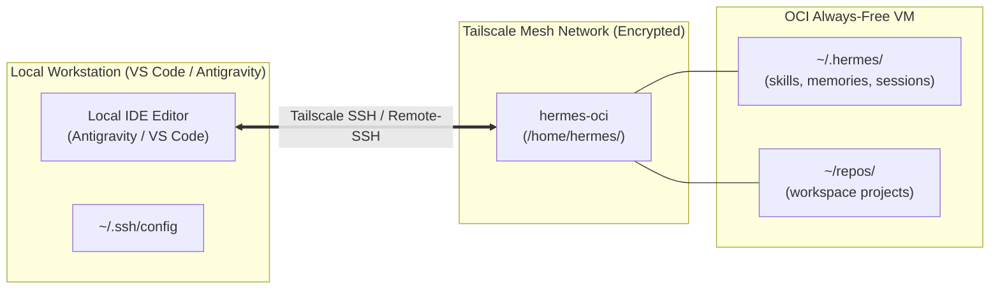

# Viewing & Editing Remote Files on OCI Hermes

This guide explains how to view, browse, and edit files located on your remote OCI Hermes VM directly inside your local **VS Code**, **Antigravity**, or editor of choice.

---

## Architecture Overview

Because your OCI Hermes VM is private and connected securely via **Tailscale**, you can access remote files without exposing any public SSH ports to the internet.



---

## Method 1: Direct Remote Editing via Remote - SSH (Recommended)

This method connects your local IDE directly to the remote VM over Tailscale. You can open any remote folder, browse file trees, search file contents, edit code, and inspect live logs in real time.

### Step 1: Configure Local SSH (`~/.ssh/config`)

Add your OCI Hermes instance to your local SSH configuration file:

- **macOS / Linux**: `~/.ssh/config`
- **Windows**: `C:\Users\<YourUsername>\.ssh\config`

```ssh
Host hermes-oci
    HostName hermes-oci.<your-tailnet>.ts.net
    User hermes
```

*(If you have Tailscale MagicDNS enabled, you can often just use `HostName hermes-oci`).*

### Step 2: Connect from Antigravity / VS Code

1. Open **VS Code** or **Antigravity**.
2. Ensure the **Remote - SSH** extension (or built-in remote SSH provider) is enabled.
3. Open the Command Palette:
   - **Windows / Linux**: `Ctrl + Shift + P`
   - **macOS**: `Cmd + Shift + P`
4. Type and select: **`Remote-SSH: Connect to Host...`**
5. Select **`hermes-oci`** from the list.
6. A new editor window will launch, establishing a secure connection to the VM.

### Step 3: Open Remote Folders

Once connected, click **Open Folder** in the Explorer sidebar:

- **Hermes State & Data**: `/home/hermes/.hermes` (to view `config.yaml`, `skills/`, `memories/`, and active chat sessions)
- **Agent Workspaces / Repos**: `/home/hermes` or `/home/hermes/repos`

> [!TIP]
> Any files created or modified by Hermes (e.g. via Telegram, web UI, or background crons) will appear and update dynamically in your file tree and editor tabs.

---

## Method 2: Real-Time Sync to a Local Folder (Syncthing)

If you prefer having physical copies of skills, memories, sessions, and persona files stored locally on your machine, use **Syncthing**.

1. **How It Works**: The VM automatically runs Syncthing (`syncthing@hermes.service`), configured to securely sync `skills/`, `profiles/`, `memories/`, `sessions/`, and `SOUL.md` over Tailscale.
2. **Setup**: Follow the full configuration guide in [docs/syncthing.md](syncthing.md) to pair your local machine with the OCI VM.
3. **Usage**: Open the synced local folder (e.g., `~/.hermes/` or `C:\Users\<user>\.hermes`) directly in your local editor. Changes made on the server will automatically sync down to your local disk within seconds.

---

## Method 3: Quick CLI File Inspection (SSH Terminal)

For quick file inspection without opening a full remote IDE session:

### View Live Service & Gateway Logs
```bash
# Follow live Telegram gateway logs
journalctl -u hermes-gateway.service -f

# Follow live Syncthing logs
journalctl -u syncthing@hermes.service -f
```

### Inspect Recent Sessions & Memories
```bash
# List recent conversation sessions
ls -lt /home/hermes/.hermes/sessions/

# View active agent memory
cat /home/hermes/.hermes/memories/MEMORY.md
```

### Quick Editor over SSH
```bash
# Edit configuration directly
nano ~/.hermes/config.yaml
```

---

## Troubleshooting

| Issue | Cause | Resolution |
|---|---|---|
| **Remote-SSH: Connection timed out** | Tailscale is not running locally or VM is not in your tailnet | Run `tailscale status` locally and ensure both your workstation and `hermes-oci` are connected. |
| **Permission denied (publickey)** | SSH keys not configured or Tailscale SSH disabled | Verify Tailscale SSH is enabled on the node or check `~/.ssh/config` user is set to `hermes`. |
| **Hidden files (`.hermes`) not visible** | VS Code / Antigravity file explorer hiding dotfiles | Check VS Code settings for `"files.exclude"` and ensure `**/.hermes` is not excluded. |

---

## See Also

- [docs/syncthing.md](syncthing.md) — Real-time bidirectional file sync between local workstations and OCI VM.
- [docs/channels.md](channels.md) — Telegram and messaging integrations.
- [docs/RUNBOOK.md](RUNBOOK.md) — Day-2 operations, backups, and provider rotation.
