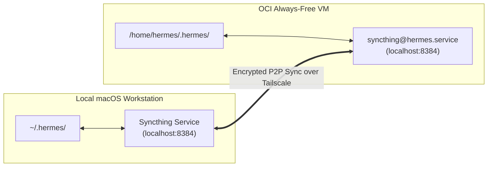

# Hermes Sync with Syncthing (macOS <-> OCI VM)

This guide provides instructions on configuring bidirectional, real-time synchronization of **Hermes skills, profiles, sessions, and memories** between your local macOS workstation and the remote OCI Always-Free VM.

---

## 1. Overview & Architecture

When switching between working locally on your Mac and remotely on your OCI VM, keeping your agent's skills, custom profiles, personality (`SOUL.md`), and session history aligned ensures you never lose context.



### What Gets Synced vs. What Is Excluded

| Category | Synced Paths | Excluded via `.stignore` |
| :--- | :--- | :--- |
| **Skills & Tools** | `skills/`, `profiles/*/skills/` | `.locks/`, temporary git artifacts |
| **Agent Profiles** | `profiles/*/profile.yaml`, `profiles/*/SOUL.md` | Profile-specific venvs, caches |
| **Sessions & History** | `sessions/*.json`, `memories/`, `SOUL.md` | Live session runtime locks |
| **System State** | `active_profile`, `channel_directory.json` | `*.sock`, `*.pid`, `*.lock`, `*.db-shm`, `*.db-wal` |
| **Binaries & Runtimes** | *None* | `bin/`, `node/`, `hermes-agent/`, `sandboxes/`, `runtime/` |
| **Caches & Logs** | *None* | `cache/`, `audio_cache/`, `image_cache/`, `logs/`, `*.log` |

---

## 2. Installation & Prerequisites

### On OCI Instance
Syncthing is automated in this repository via:
- `terraform/templates/cloud-init.yaml.tftpl` (included in package installs)
- `terraform/templates/bootstrap.sh` (service auto-enabled at boot)
- `scripts/hermes-setup.sh` (interactive setup & status reporter)

To verify or manually install Syncthing on an existing OCI VM:
```bash
# 1. SSH into the OCI instance
ssh hermes@hermes-oci

# 2. Verify or install syncthing package
sudo apt-get update && sudo apt-get install -y syncthing

# 3. Enable and start Syncthing systemd service for the hermes user
sudo systemctl enable --now syncthing@hermes.service

# 4. Confirm the service is running
sudo systemctl status syncthing@hermes.service
```

### On Local macOS
Install Syncthing using Homebrew:
```bash
# Install Syncthing CLI & background service
brew install syncthing

# Start Syncthing service as a background login daemon
brew services start syncthing
```

*(Alternatively, you can install the standalone macOS menu-bar app from [syncthing-macos](https://github.com/syncthing/syncthing-macos)).*

---

## 3. Configure Ignore Rules (`.stignore`)

To prevent macOS-specific binaries, socket files, or active database locks from clobbering Linux binaries on OCI, ensure both machines have identical `.stignore` files in their respective `~/.hermes/` roots.

```text
// 1. WHITELIST FIRST: un-ignore skills, profiles, memories, sessions everywhere
!skills
!skills/**
!profiles
!profiles/**
!memories
!memories/**
!sessions
!sessions/**
!SOUL.md
!active_profile

// 2. Never sync lock files, sockets, PIDs, SQLite WALs, or conflict duplicates
(?d)*.lock
(?d)*.sock
(?d)*.pid
(?d)*.db
(?d)*.db-shm
(?d)*.db-wal
(?d)*.sync-conflict-*

// 3. Never sync caches, logs, backups, or machine-specific runtimes
(?d)cache
(?d)audio_cache
(?d)image_cache
(?d)logs
(?d)*.log
(?d)backups
(?d).curator_backups
(?d)tools
(?d)environments
(?d)installs
(?d)source-checks
(?d)plugin-update-checks
(?d)terminal-sessions
(?d)hermes-agent
(?d)bin
(?d)node
(?d)runtime
(?d)sandboxes
(?d)desktop
(?d)desktop-plugins
(?d)models_dev_cache.*
(?d)provider_models_cache.json
(?d)context_length_cache.yaml
(?d)processes.json
(?d)spawn-ledger.json
(?d)gateway*

// 4. Ignore all other root files (.env, auth.json, internal databases)
*
```

> [!TIP]
> The `(?d)` prefix tells Syncthing that it is safe to delete these ignored files if a parent directory is deleted on the other node.

---

## 4. Pairing macOS and OCI

### Step A: Access the Web GUIs

1. **macOS Web GUI**:
   Open [http://localhost:8384](http://localhost:8384) in your Mac browser.

2. **OCI Web GUI**:
   Since Syncthing's web UI binds to `127.0.0.1:8384` on OCI, access it securely using an SSH port forward:
   ```bash
   ssh -L 8385:localhost:8384 hermes@hermes-oci
   ```
   Now open [http://localhost:8385](http://localhost:8385) in your Mac browser to manage the OCI Syncthing instance.

---

### Step B: Exchange Device IDs

1. **Find OCI Device ID**:
   - In OCI terminal, run:
     ```bash
     syncthing --device-id
     ```
   - Or in the OCI Web GUI ([http://localhost:8385](http://localhost:8385)), click **Actions** (top right) → **Show ID**.

2. **Add OCI Device on macOS**:
   - On macOS Web GUI ([http://localhost:8384](http://localhost:8384)), under **Remote Devices**, click **Add Remote Device**.
   - Paste the **OCI Device ID**.
   - Set **Device Name** to `hermes-oci`.
   - In the **Sharing** tab, leave folder selection empty for now (we'll configure the folder next).
   - Click **Save**.

3. **Accept Connection on OCI**:
   - Refresh the OCI Web GUI ([http://localhost:8385](http://localhost:8385)).
   - A prompt will appear: *"Device ... wants to connect. Add device?"*
   - Click **Add Device** and save.

---

### Step C: Share the `~/.hermes` Folder

1. **On macOS**:
   - Click **Add Folder** under **Folders**.
   - **Folder Label**: `Hermes State`
   - **Folder ID**: `hermes-sync` *(Important: Must match on both devices!)*
   - **Folder Path**: `/Users/<your-username>/.hermes`
   - Go to the **Sharing** tab → Check `hermes-oci`.
   - Go to the **File Versioning** tab → Select **Staggered File Versioning** or **Trash Can File Versioning** (recommended safety cushion).
   - Click **Save**.

2. **On OCI**:
   - Refresh [http://localhost:8385](http://localhost:8385). A prompt will appear: *"Device hermes-mac wants to share folder 'hermes-sync'. Add folder?"*
   - Click **Add Folder**.
   - Set **Folder Path** to `/home/hermes/.hermes`.
   - Click **Save**.

---

## 5. Verification & Testing

1. **Check Sync Status**:
   In both Web GUIs, verify that the folder state changes from `Syncing` to `Up to Date`.

2. **Test Real-Time Sync**:
   - **Skills test**: Create or install a new skill on Mac:
     ```bash
     hermes skill install official/creative/excalidraw
     ```
     Check your OCI instance (`ls /home/hermes/.hermes/skills/`) to see it appear automatically.
   - **Soul test**: Edit `~/.hermes/SOUL.md` on your Mac. Check that the changes reflect on OCI within seconds.
   - **Session test**: Run an interactive hermes command on OCI. Verify that the session log appears in `~/.hermes/sessions/` on your Mac.

---

## 6. Maintenance & Troubleshooting

### Useful Commands

| Task | Command (macOS) | Command (OCI) |
| :--- | :--- | :--- |
| **Service Status** | `brew services info syncthing` | `sudo systemctl status syncthing@hermes` |
| **Restart Service** | `brew services restart syncthing` | `sudo systemctl restart syncthing@hermes` |
| **View Live Logs** | `cat $(brew --prefix)/var/log/syncthing.log` | `journalctl -u syncthing@hermes -f` |
| **Get Device ID** | `syncthing --device-id` | `sudo -u hermes syncthing --device-id` |

### Common Issues

1. **Permission Denied on OCI**:
   Ensure all files under `/home/hermes/.hermes` are owned by the `hermes` user:
   ```bash
   sudo chown -R hermes:hermes /home/hermes/.hermes
   ```

2. **Conflict Resolution**:
   If a conflict occurs (e.g. `SOUL.sync-conflict-...md`), Syncthing preserves both files. Review the differences and remove the `.sync-conflict` file.

3. **Restarting Syncthing after changing `.stignore`**:
   Whenever you modify `.stignore`, trigger a rescan in the Web GUI or restart the service to apply the new patterns.
